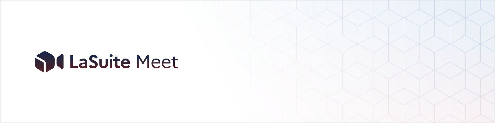

  

  
  
  
  
      

  <a href="https://livekit.io/">LiveKit</a> - <a href="https://matrix.to/#/#meet-official:matrix.org">Chat with us</a> - <a href="https://github.com/orgs/suitenumerique/projects/3/views/2">Roadmap</a> - <a href="https://github.com/suitenumerique/meet/blob/main/CHANGELOG.md">Changelog</a> - <a href="https://github.com/suitenumerique/meet/issues/new?assignees=&labels=bug&template=Bug_report.md">Bug reports</a> 

  

## La Suite Meet: Simple Video Conferencing

Powered by [LiveKit](https://livekit.io/), La Suite Meet offers Zoom-level performance with high-quality video and audio. No installation required—simply join calls directly from your browser. Check out LiveKit's impressive optimizations in their [blog post](https://blog.livekit.io/livekit-one-dot-zero/).
### Features
- Optimized for stability in large meetings (+100 p.)
- Support for multiple screen sharing streams
- Non-persistent, secure chat
- End-to-end encryption (coming soon)
- Meeting recording
- Meeting transcription & Summary (currently in beta)
- Telephony integration
- Secure participation with robust authentication and access control
- Customizable frontend style
- LiveKit Advances features including :
  - speaker detection 
  - simulcast 
  - end-to-end optimizations 
  - selective subscription
  - SVC codecs (VP9, AV1)

La Suite Meet is fully self-hostable and released under the MIT License, ensuring complete control and flexibility. It's simple to [get started](https://visio.numerique.gouv.fr/) or [request a demo](mailto:visio@numerique.gouv.fr). 

We’re continuously adding new features to enhance your experience, with the latest updates coming soon!

### 🚀 Major roll out to all French public servants

On the 25th of January 2026, David Amiel, France’s Minister for Civil Service and State Reform, announced the full deployment of Visio—the French government’s dedicated Meet platform—to all public servants. ([Source in French](https://www.latribune.fr/article/la-tribune-dimanche/politique/73157688099661/david-amiel-ministre-delegue-de-la-fonction-publique-nous-allons-sortir-de-la-dependance-aux-outils-americains))

## Table of Contents

- [Get started](#get-started)
- [Docs](#docs)
- [Self-host](#self-host)
- [Contributing](#contributing)
- [Philosophy](#philosophy)
- [Open source](#open-source)

## Get started

## Docs

We're currently working on both technical and user documentation for La Suite Meet. In the meantime, many of the essential aspects are already well covered by the [LiveKit documentation](https://docs.livekit.io/home/) and their [self-hosting guide](https://docs.livekit.io/home/self-hosting/deployment/). Stay tuned for more updates!

## Self-host

### La Suite Meet is easy to install on your own servers

We use Kubernetes for our [production instance](https://visio.numerique.gouv.fr/) but also support Docker Compose. The community contributed a couple other methods (Nix, YunoHost etc.) check out the [docs](/docs/installation/README.md) to get detailed instructions and examples.

**Questions?** Open an issue on [GitHub](https://github.com/suitenumerique/meet/issues/new?assignees=&labels=bug&template=Bug_report.md) or join our [Matrix community](https://matrix.to/#/#meet-official:matrix.org).

> [!NOTE]
> Some advanced features (ex: recording, transcription) lack detailed documentation. We're working hard to provide comprehensive guides soon.

#### Known instances
We hope to see many more, here is an incomplete list of public La Suite Meet instances. Feel free to make a PR to add ones that are not listed below🙏

| Url                                                           | Org | Access |
|---------------------------------------------------------------| --- | ------- |
| [visio.numerique.gouv.fr](https://visio.numerique.gouv.fr/)   | DINUM    | French public agents working for the central administration and the extended public sphere. ProConnect is required to login in or sign up|
| [visio.suite.anct.gouv.fr](https://visio.suite.anct.gouv.fr/) | ANCT    | French public agents working for the territorial administration and the extended public sphere. ProConnect is required to login in or sign up|
| [visio.lasuite.coop](https://visio.lasuite.coop/)             | lasuite.coop    | Free and open demo to all. Content and accounts are reset after one month |
| [mosacloud.cloud](https://mosa.cloud/)                        | mosa.cloud    | Demo instance of mosa.cloud, a dutch company providing services around La Suite apps. |

## Contributing

We <3 contributions of any kind, big and small:

- Vote on features or get early access to beta functionality in our [roadmap](https://github.com/orgs/suitenumerique/projects/11/views/4)
- Open a PR (see our instructions on [developing La Suite Meet locally](https://github.com/suitenumerique/meet/blob/main/docs/developping_locally.md))
- Submit a [feature request](https://github.com/suitenumerique/meet/issues/new?assignees=&labels=enhancement&template=Feature_request.md) or [bug report](https://github.com/suitenumerique/meet/issues/new?assignees=&labels=bug&template=Bug_report.md)

## Philosophy

We’re relentlessly focused on building the best open-source video conferencing product—La Suite Meet. Growth comes from creating something people truly need, not just from chasing metrics.

Our users come first. We’re committed to making La Suite Meet as accessible and easy to use as proprietary solutions, ensuring it meets the highest standards.

Most of the heavy engineering is handled by the incredible LiveKit team, allowing us to focus on delivering a top-tier product. We follow extreme programming practices, favoring pair programming and quick, iterative releases. Challenge our tech and architecture—simplicity is always our top priority.

## Open-source

Gov 🇫🇷 supports open source! This project is available under [MIT license](https://github.com/suitenumerique/meet/blob/0cc2a7b7b4f4821e2c4d9d790efa739622bb6601/LICENSE).

All features we develop will always remain open-source, and we are committed to contributing back to the LiveKit community whenever feasible.
To learn more, don't hesitate to [reach out](mailto:visio@numerique.gouv.fr).

### Help us!

Come help us make La Suite Meet even better. We're growing fast and [would love some help](mailto:visio@numerique.gouv.fr).

## Contributors 🧞

## Credits 

We're using the awesome [LiveKit](https://livekit.io/) implementation. We're also thankful to the teams behind [Django Rest Framework](https://www.django-rest-framework.org/), [Vite.js](https://vite.dev/), and [React Aria](https://github.com/adobe/react-spectrum) — Thanks for your amazing work!
This project is tested with BrowserStack.

## License

Code in this repository is published under the MIT license by DINUM (Direction interministériel du numérique).
Documentation (in the docs/) directory is released under the [Etalab-2.0 license](https://spdx.org/licenses/etalab-2.0.html).

