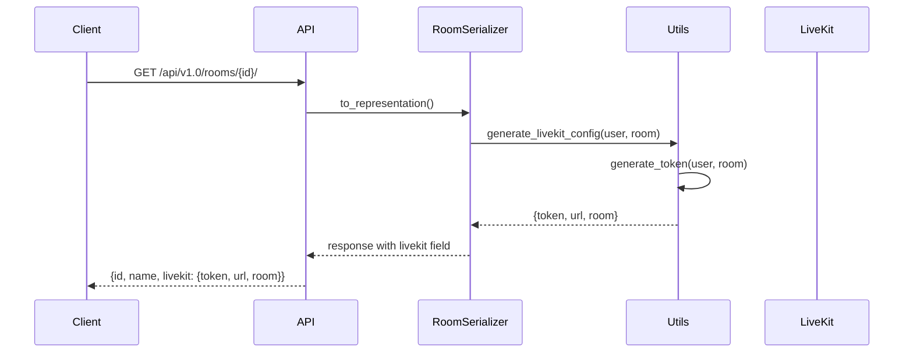
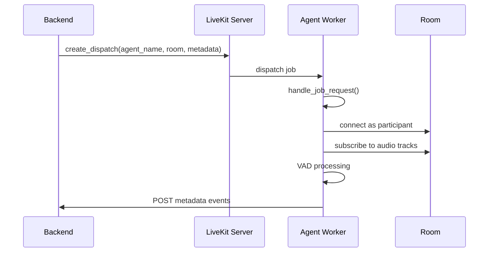
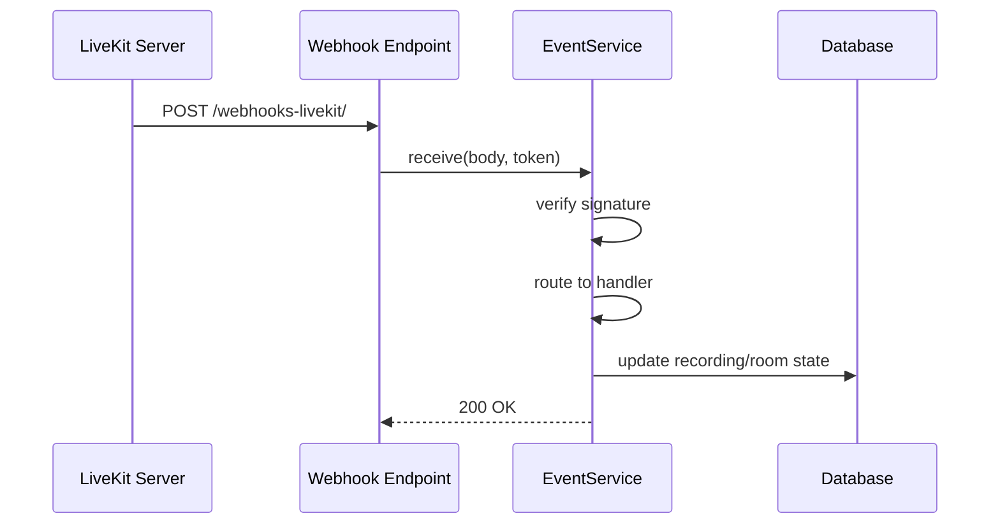
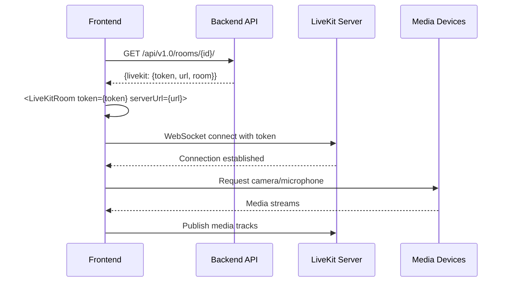

# LiveKit Integration

This page explains how Meet integrates with LiveKit at both the backend (Python) and frontend (TypeScript) levels.

## Overview

LiveKit integration has two main components:

1. **Backend (Python)**: Generates JWT tokens, manages LiveKit API calls for Egress (recording), Agent dispatch (metadata collection, subtitles), SIP integration etc.
2. **Frontend (TypeScript)**: Uses the LiveKit JavaScript SDK (livekit-client) for WebRTC media streaming, with LiveKit React components providing UI and state management

## Backend Integration

### Token Generation and Room Access

**Implementation**: `src/backend/core/utils.py:63-136`

The `generate_token()` function creates JWT tokens with video grants for room access. The token generation includes:
- User identity and name mapping
- Room-specific permissions (publish/subscribe/data)
- Admin privileges for room owners

**Room Serializer**: `src/backend/core/api/serializers.py:127-194`

The `RoomSerializer.to_representation()` method (lines 145-193) generates the LiveKit configuration and injects it into the API response. This is where `generate_livekit_config()` is called (line 181), returning the token, URL, and room name to the client via the `livekit` field.

### LiveKit API Client

**Implementation**: `src/backend/core/utils.py:212-224`

The `create_livekit_client()` function creates authenticated LiveKit API clients for server-side operations.

### Egress (Recording)

**Implementation**: `src/backend/core/recording/worker/services.py`

- `VideoCompositeEgressService.start()` (lines 108-140): Starts video recording with composite layout
- `AudioCompositeEgressService.start()` (lines 148-171): Starts audio-only recording
- `BaseEgressService.stop()` (lines 52-77): Stops active egress sessions

Both services create `RoomCompositeEgressRequest` objects and dispatch them to the LiveKit server's egress API.

### Metadata Collector Agent

**Backend Service**: `src/backend/core/recording/services/metadata_collector.py:22-91`

- `MetadataCollectorService.start()` (lines 26-61): Dispatches the metadata collector agent to a room
- Uses `create_dispatch()` API call to start the agent with room-specific metadata

**Agent Implementation**: `src/agents/metadata_collector.py`

- `MetadataCollector` class (lines 174-327): Main agent that collects voice activity and participant metadata
- `VADAgent` (lines 78-172): Voice activity detection using Silero VAD
- Job handling (lines 371-396): Accepts jobs and attaches to LiveKit rooms as a silent participant

### Webhooks

**Endpoint**: `src/backend/core/api/viewsets.py:561-583`

The `webhooks_livekit()` action receives POST requests from LiveKit server at `/api/v1.0/rooms/webhooks-livekit/`.

**Event Processing**: `src/backend/core/services/livekit_events.py:86-271`

The `LiveKitEventsService` class handles webhook events:
- `receive()` (lines 119-150): Verifies webhook signature and routes events
- `_handle_egress_updated()` (lines 152-165): Updates recording status
- `_handle_egress_ended()` (lines 166-220): Processes completed recordings, handles metadata collector cleanup
- `_handle_room_started()` (lines 221-244): Tracks room start events
- `_handle_room_finished()` (lines 246-271): Handles room cleanup

Supported events are defined in `LiveKitWebhookEventType` enum (lines 61-84).

### Room Metadata and Notifications

**Implementation**: `src/backend/core/utils.py`

- `notify_participants()` (lines 232-258): Sends data messages to all participants in a room
- `update_room_metadata()` (lines 266-309): Updates LiveKit room metadata (used for room state synchronization)

### SIP and Telephony

**Implementation**: `src/backend/core/services/telephony.py`

Manages SIP dispatch rules for phone dial-in to LiveKit rooms.

### Subtitle Agent Dispatch

**Implementation**: `src/backend/core/services/subtitle.py:24-38`

The `start_subtitle()` function dispatches subtitle agents to rooms using the same agent dispatch mechanism as metadata collectors.

## Frontend Integration

**Main Component**: `src/frontend/src/features/rooms/components/Conference.tsx:220-311`

The `Conference` component receives the LiveKit configuration from the room API response and connects using the `<LiveKitRoom>` component (lines 220-311). The server URL and token from the backend (lines 222-223) are passed directly to the LiveKit SDK.

**Room Options**: `Conference.tsx:98-124`

Configures room behavior including connection timeouts, automatic subscription, and adaptive streaming.

**Firefox Proxy Workaround**: `Conference.tsx:136-171`

Implements connection warm-up for Firefox browser compatibility.

**Video Conference UI**: `src/frontend/src/features/rooms/livekit/prefabs/VideoConference.tsx`

The complete video conference interface using LiveKit's prefab components, including:
- Room metadata synchronizer (line 64)
- Connection observer (line 65)

**Utility Functions**: `src/frontend/src/utils/livekit.ts`

Browser detection utilities for LiveKit compatibility:
- `isFireFox()` (lines 3-4)
- `isChromiumBased()` (lines 7-8)
- `isLocal()` (lines 15-17): Checks if participant is the local user

**Dependencies**: `src/frontend/package.json`

- `@livekit/components-react: 2.9.21` (line 22)
- `@livekit/components-styles: 1.2.0` (line 23)
- `livekit-client: 2.20.0` (line 39)

## Authentication

**Implementation**: `src/backend/core/authentication/livekit.py:13-51`

The `LiveKitTokenAuthentication` class verifies LiveKit JWT tokens for API requests that require LiveKit-based authentication. It uses `TokenVerifier` to validate tokens and looks up users by their LiveKit identity.

## Configuration

**Backend Settings**: `src/backend/meet/settings.py:1237-1238`

Development configuration for LiveKit API key and secret.

**LiveKit Server Config**: `docker/livekit/config/livekit-server.yaml:7-10`

Webhook configuration pointing to the backend endpoint.

**Python Dependencies**: `src/backend/pyproject.toml:63`

`livekit-api==1.1.1`

## Testing

For unit tests, mock the LiveKit API at the boundary (e.g., in serializers or service classes).

For integration tests, the development Docker Compose stack runs a real LiveKit server in `--dev` mode.
