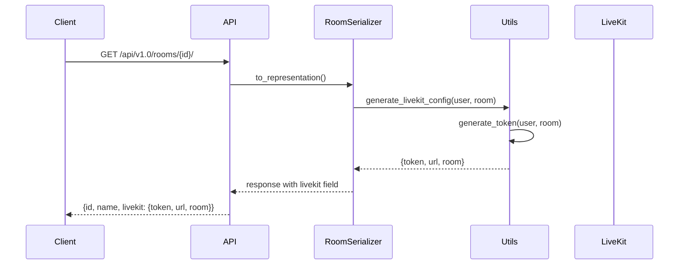
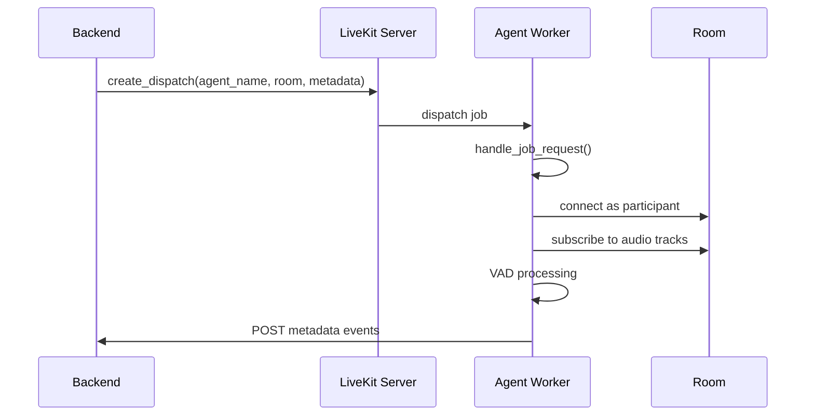
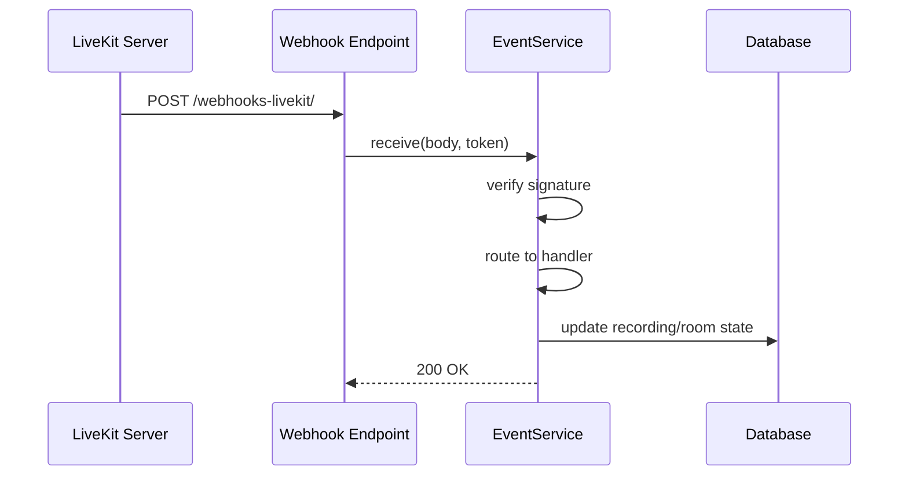
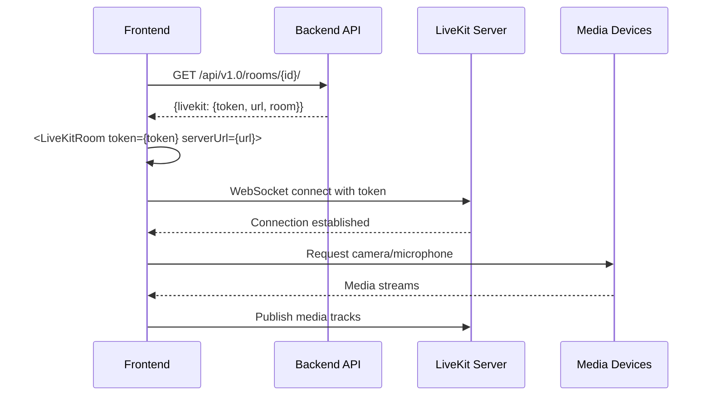

# LiveKit Integration

This page explains how Meet integrates with LiveKit at both the backend (Python) and frontend (TypeScript) levels.

## Overview

LiveKit integration has two main components:

1. **Backend (Python)**: Generates JWT tokens, manages LiveKit API calls for Egress (recording), Agent dispatch (metadata collection, subtitles), SIP integration etc.
2. **Frontend (TypeScript)**: Uses the LiveKit JavaScript SDK (livekit-client) for WebRTC media streaming, with LiveKit React components providing UI and state management

## Backend Integration

### Token Generation and Room Access

**Implementation**: `generate_token()` in `src/backend/core/utils.py`

Creates JWT tokens with video grants for room access. The token generation includes:
- User identity and name mapping
- Room-specific permissions (publish/subscribe/data)
- Admin privileges for room owners

**Room Serializer**: `RoomSerializer` in `src/backend/core/api/serializers.py`

`RoomSerializer.to_representation()` generates the LiveKit configuration and injects it into the API response, calling `generate_livekit_config()` (also in `utils.py`) to return the token, URL, and room name to the client via the `livekit` field.

### LiveKit API Client

**Implementation**: `create_livekit_client()` in `src/backend/core/utils.py`

Creates authenticated LiveKit API clients for server-side operations.

### Egress (Recording)

**Implementation**: `src/backend/core/recording/worker/services.py`

- `VideoCompositeEgressService.start()`: Starts video recording with composite layout
- `AudioCompositeEgressService.start()`: Starts audio-only recording
- `BaseEgressService.stop()`: Stops active egress sessions

Both services create `RoomCompositeEgressRequest` objects and dispatch them to the LiveKit server's egress API.

### Metadata Collector Agent

**Backend Service**: `src/backend/core/recording/services/metadata_collector.py`

- `MetadataCollectorService.start()`: Dispatches the metadata collector agent to a room
- Uses `create_dispatch()` API call to start the agent with room-specific metadata

**Agent Implementation**: `src/agents/metadata_collector.py`

- `MetadataCollector` class: Main agent that collects voice activity and participant metadata
- `VADAgent`: Voice activity detection using Silero VAD
- `handle_job_request()`/`entrypoint()`: Accepts jobs and attaches to LiveKit rooms as a silent participant

### Webhooks

**Endpoint**: `webhooks_livekit()` in `src/backend/core/api/viewsets.py`

Receives POST requests from LiveKit server at `/api/v1.0/rooms/webhooks-livekit/`.

**Event Processing**: `LiveKitEventsService` in `src/backend/core/services/livekit_events.py`

The `LiveKitEventsService` class handles webhook events:
- `receive()`: Verifies webhook signature and routes events
- `_handle_egress_updated()`: Updates recording status
- `_handle_egress_ended()`: Processes completed recordings, handles metadata collector cleanup
- `_handle_room_started()`: Tracks room start events
- `_handle_room_finished()`: Handles room cleanup

Supported events are defined in the `LiveKitWebhookEventType` enum in the same file.

### Room Metadata and Notifications

**Implementation**: `src/backend/core/utils.py`

- `notify_participants()`: Sends data messages to all participants in a room
- `update_room_metadata()`: Updates LiveKit room metadata (used for room state synchronization)

### SIP and Telephony

**Implementation**: `src/backend/core/services/sip_management.py`

Manages SIP dispatch rules for phone dial-in to LiveKit rooms. Telephony helpers (`build_telephony_config`, phone number formatting) live in `src/backend/core/utils.py`.

### Subtitle Agent Dispatch

**Implementation**: `SubtitleService.start_subtitle()` in `src/backend/core/services/subtitle.py`

Dispatches subtitle agents to rooms using the same agent dispatch mechanism as metadata collectors.

## Frontend Integration

**Main Component**: `Conference` in `src/frontend/src/features/rooms/components/Conference.tsx`

Receives the LiveKit configuration from the room API response and connects using the `<LiveKitRoom>` component. The server URL and token from the backend are passed directly to the LiveKit SDK.

**Room Options**: same file, room-options object passed to `<LiveKitRoom>`

Configures room behavior including connection timeouts, automatic subscription, and adaptive streaming.

**Firefox Proxy Workaround**: same file, gated on `isFireFox() && apiConfig.livekit.enable_firefox_proxy_workaround`

Implements connection warm-up for Firefox browser compatibility.

**Video Conference UI**: `src/frontend/src/features/rooms/livekit/prefabs/VideoConference.tsx`

The complete video conference interface using LiveKit's prefab components, including `RoomMetadataSynchronizer` and `ConnectionObserver`.

**Utility Functions**: `src/frontend/src/utils/livekit.ts`

Browser detection utilities for LiveKit compatibility: `isFireFox()`, `isChromiumBased()`, `isLocal()` (checks if participant is the local user).

**Dependencies**: `src/frontend/package.json` - see that file for the currently pinned versions of `@livekit/components-react`, `@livekit/components-styles`, and `livekit-client`.

## Authentication

**Implementation**: `LiveKitTokenAuthentication` in `src/backend/core/authentication/livekit.py`

Verifies LiveKit JWT tokens for API requests that require LiveKit-based authentication. It uses `TokenVerifier` to validate tokens and looks up users by their LiveKit identity.

## Configuration

**Backend Settings**: `Test` configuration class in `src/backend/meet/settings.py`

Hardcoded LiveKit API key and secret used for tests.

**LiveKit Server Config**: `docker/livekit/config/livekit-server.yaml`, `webhook:` section

Webhook configuration pointing to the backend endpoint.

**Python Dependencies**: `src/backend/pyproject.toml` - see that file for the currently pinned `livekit-api` version.

## Testing

For unit tests, mock the LiveKit API at the boundary (e.g., in serializers or service classes).

For integration tests, the development Docker Compose stack runs a real LiveKit server in `--dev` mode.
