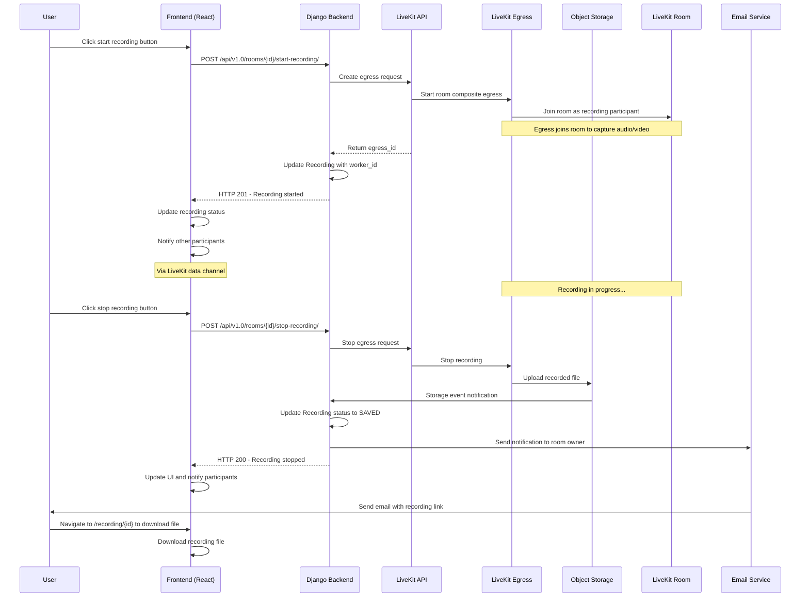

# Room Recording (Beta)

La Suite Meet offers a room recording feature that is currently in beta, with ongoing improvements planned. 

The feature allows users to record their room sessions. When a recording is complete, the room owner receives a notification with a link to download the recorded file. Recordings are automatically deleted after `RECORDING_EXPIRATION_DAYS`.

It uses LiveKit Egress to record room sessions. For reference, see the [LiveKit Egress repository](https://github.com/livekit/egress) and the [official documentation](https://docs.livekit.io/home/egress/overview/).

**Current Limitations**:

* Users cannot record and transcribe simultaneously. ([Issue #527](https://github.com/suitenumerique/meet/issues/527)
 is on our backlog)
* Recording layout cannot be configured from the frontend. By default, the egress captures the active speaker and any shared screens. (not yet planned)
* Shareable links with an embedded video player are not yet supported. (not yet planned)

> [!NOTE]
> Questions? Open an issue on [GitHub](https://github.com/suitenumerique/meet/issues/new?assignees=&labels=bug&template=Bug_report.md) or join our [Matrix community](https://matrix.to/#/#meet-official:matrix.org).


## Special requirements

To use the room recording feature, the following components are required:

- A running [LiveKit Egress](https://github.com/livekit/egress) server capable of handling room composite recordings.
- A S3-compatible object storage that supports webhook events to notify the backend when recordings are uploaded.
- An email service to notify room owners when a recording is available for download.
- Webhook events configured between LiveKit Server and the backend.


> [!CAUTION]
>  Minio supports lifecycle events; other providers may not work out of the box. There is currently a dependency on Minio, which is planned to be refactored in the future.

> [!NOTE]
> Celery isn’t in use for these async tasks yet. It’s something we’d like to add, but it’s not planned at this stage.


## How It Works



## Configuration Options

| Option                                  | Type        | Default                                                                                                                                                            | Description                                                                                                                                                                                                                                                                                        |
| --------------------------------------- | ----------- | ------------------------------------------------------------------------------------------------------------------------------------------------------------------ |----------------------------------------------------------------------------------------------------------------------------------------------------------------------------------------------------------------------------------------------------------------------------------------------------|
| **RECORDING_ENABLE**                    | Boolean     | `False`                                                                                                                                                            | Enable or disable the room recording feature.                                                                                                                                                                                                                                                      |
| **RECORDING_OUTPUT_FOLDER**             | String      | `"recordings"`                                                                                                                                                     | Folder/prefix where recordings are stored in the object storage.                                                                                                                                                                                                                                   |
| **RECORDING_WORKER_CLASSES**            | Dict        | `{ "screen_recording": "core.recording.worker.services.VideoCompositeEgressService", "transcript": "core.recording.worker.services.AudioCompositeEgressService" }` | Maps recording types to their worker service classes.                                                                                                                                                                                                                                              |
| **RECORDING_EVENT_PARSER_CLASS**        | String      | `"core.recording.event.parsers.MinioParser"`                                                                                                                       | Class responsible for parsing storage events and updating the backend.                                                                                                                                                                                                                             |
| **RECORDING_ENABLE_STORAGE_EVENT_AUTH** | Boolean     | `True`                                                                                                                                                             | Enable authentication for storage event webhook requests.                                                                                                                                                                                                                                          |
| **RECORDING_STORAGE_EVENT_ENABLE**      | Boolean     | `False`                                                                                                                                                            | Enable handling of storage events (must configure webhook in storage).                                                                                                                                                                                                                             |
| **RECORDING_STORAGE_EVENT_TOKEN**       | Secret/File | `None`                                                                                                                                                             | Token used to authenticate storage webhook requests, if `RECORDING_ENABLE_STORAGE_EVENT_AUTH` is enabled.                                                                                                                                                                                          |
| **RECORDING_EXPIRATION_DAYS**           | Integer     | `None`                                                                                                                                                             | Number of days before recordings expire. Should match bucket lifecycle policy. Set to `None` for no expiration.                                                                                                                                                                                    |
| **RECORDING_MAX_DURATION**              | Integer     | `None`                                                                                                                                                             | Maximum duration of a recording in milliseconds. Must be synced with the LiveKit Egress configuration. Set to None for unlimited duration. When the maximum duration is reached, the recording is automatically stopped and saved, and the user is prompted in the frontend with an alert message. |


### Manual Storage Webhook

Storage events must be configured manually; the Kubernetes chart does not do this automatically.

1. Configure your S3 bucket to send file creation events to the backend webhook.
2. Enable events and token in settings:

```python
RECORDING_STORAGE_EVENT_ENABLE = True
RECORDING_ENABLE_STORAGE_EVENT_AUTH = True
RECORDING_STORAGE_EVENT_TOKEN = <token>
```

> [!NOTE]
> Questions? Open an issue on [GitHub](https://github.com/suitenumerique/meet/issues/new?assignees=&labels=bug&template=Bug_report.md) or join our [Matrix community](https://matrix.to/#/#meet-official:matrix.org).


## LiveKit Egress

La Suite Meet uses LiveKit Egress to record room sessions. For reference, see the [LiveKit Egress repository](https://github.com/livekit/egress) and the [official documentation](https://docs.livekit.io/home/egress/overview/).

Currently, only `RoomCompositeEgress` is supported. This mode combines all video and audio tracks from the room into a single recording.

To monitor egress workers and inspect recording status, it is recommended to install `livekit-cli`. For example, you can list active egress sessions using the following command:

```bash
$ livekit-cli list-egress

Using default project meet
+-----------------+---------------+----------------+--------------------------------------+--------------------------------+-------+
|    EGRESSID     |    STATUS     |      TYPE      |                SOURCE                |           STARTED AT           | ERROR |
+-----------------+---------------+----------------+--------------------------------------+--------------------------------+-------+
| EG_XXXXXXXXXXXX | EGRESS_ACTIVE | room_composite | your-room-name-XXXXXXXXXXX-XXXXXXXXX | 2024-07-05 18:11:37.073847924  |       |
|                 |               |                |                                      | +0200 CEST                     |       |
+-----------------+---------------+----------------+--------------------------------------+--------------------------------+-------+
```

This allows you to verify which recordings are in progress, troubleshoot egress issues, and confirm that recordings are being processed correctly.

