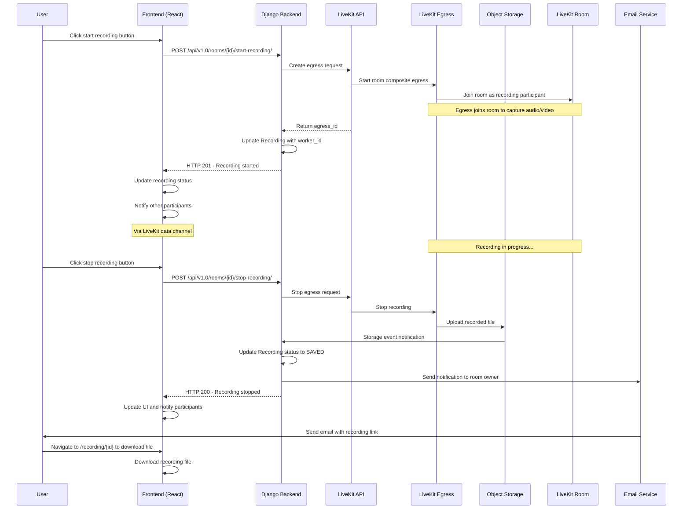

# Room Recording (Beta)

La Suite Meet offers a room recording feature that is currently in beta, with ongoing improvements planned. 

The feature allows users to record their room sessions. When a recording is complete, the room owner receives a notification with a link to download the recorded file. Recordings are automatically deleted after `RECORDING_EXPIRATION_DAYS`.

It uses LiveKit Egress to record room sessions. For reference, see the [LiveKit Egress repository](https://github.com/livekit/egress) and the [official documentation](https://docs.livekit.io/home/egress/overview/).

**Current Limitations**:

* Users cannot record and transcribe simultaneously. ([Issue #527](https://github.com/suitenumerique/meet/issues/527)
 is on our backlog)
* Recording layout cannot be configured from the frontend. By default, the egress captures the active speaker and any shared screens. (not yet planned)
* Shareable links with an embedded video player are not yet supported. (not yet planned)

> [!NOTE]
> Questions? Open an issue on [GitHub](https://github.com/suitenumerique/meet/issues/new?assignees=&labels=bug&template=Bug_report.md) or join our [Matrix community](https://matrix.to/#/#meet-official:matrix.org).


## Special requirements

To use the room recording feature, the following components are required:

- A running [LiveKit Egress](https://github.com/livekit/egress) server capable of handling room composite recordings.
- A S3-compatible object storage that supports webhook events to notify the backend when recordings are uploaded.
- An email service to notify room owners when a recording is available for download.
- Webhook events configured between LiveKit Server and the backend.


> [!CAUTION]
>  Minio supports lifecycle events; other providers may not work out of the box. There is currently a dependency on Minio, which is planned to be refactored in the future.

> [!NOTE]
> Celery isn’t in use for these async tasks yet. It’s something we’d like to add, but it’s not planned at this stage.


## How It Works


```mermaid
sequenceDiagram
    participant User
    participant Frontend as Frontend (React)
    participant Backend as Django Backend
    participant LiveKit as LiveKit API
    participant Egress as LiveKit Egress
    participant Storage as Object Storage
    participant Room as LiveKit Room
    participant Email as Email Service

    User->>Frontend: Click start recording button
    
    Frontend->>Backend: POST /api/v1.0/rooms/{id}/start-recording/
  
    Backend->>LiveKit: Create egress request
    
    LiveKit->>Egress: Start room composite egress
    Egress->>Room: Join room as recording participant
    Note over Egress,Room: Egress joins room to capture audio/video
    
    LiveKit-->>Backend: Return egress_id
    Backend->>Backend: Update Recording with worker_id
    Backend-->>Frontend: HTTP 201 - Recording started
    
    Frontend->>Frontend: Update recording status
    Frontend->>Frontend: Notify other participants
    Note over Frontend: Via LiveKit data channel
    
    Note over Egress,Room: Recording in progress...
    
    User->>Frontend: Click stop recording button
    Frontend->>Backend: POST /api/v1.0/rooms/{id}/stop-recording/
    
    Backend->>LiveKit: Stop egress request
    LiveKit->>Egress: Stop recording
    Egress->>Storage: Upload recorded file
    
    Storage->>Backend: Storage event notification
    Backend->>Backend: Update Recording status to SAVED
    Backend->>Email: Send notification to room owner
    
    Backend-->>Frontend: HTTP 200 - Recording stopped
    Frontend->>Frontend: Update UI and notify participants
    
    Email->>User: Send email with recording link
    User->>Frontend: Navigate to /recording/{id} to download file
    Frontend->>Frontend: Download recording file
```

## Configuration Options

| Option                                  | Type        | Default                                                                                                                                                            | Description                                                                                                                                                                                                                                                                                        |
| --------------------------------------- | ----------- | ------------------------------------------------------------------------------------------------------------------------------------------------------------------ |----------------------------------------------------------------------------------------------------------------------------------------------------------------------------------------------------------------------------------------------------------------------------------------------------|
| **RECORDING_ENABLE**                    | Boolean     | `False`                                                                                                                                                            | Enable or disable the room recording feature.                                                                                                                                                                                                                                                      |
| **RECORDING_OUTPUT_FOLDER**             | String      | `"recordings"`                                                                                                                                                     | Folder/prefix where recordings are stored in the object storage.                                                                                                                                                                                                                                   |
| **RECORDING_WORKER_CLASSES**            | Dict        | `{ "screen_recording": "core.recording.worker.services.VideoCompositeEgressService", "transcript": "core.recording.worker.services.AudioCompositeEgressService" }` | Maps recording types to their worker service classes.                                                                                                                                                                                                                                              |
| **RECORDING_EVENT_PARSER_CLASS**        | String      | `"core.recording.event.parsers.MinioParser"`                                                                                                                       | Class responsible for parsing storage events and updating the backend.                                                                                                                                                                                                                             |
| **RECORDING_ENABLE_STORAGE_EVENT_AUTH** | Boolean     | `True`                                                                                                                                                             | Enable authentication for storage event webhook requests.                                                                                                                                                                                                                                          |
| **RECORDING_STORAGE_EVENT_ENABLE**      | Boolean     | `False`                                                                                                                                                            | Enable handling of storage events (must configure webhook in storage).                                                                                                                                                                                                                             |
| **RECORDING_STORAGE_EVENT_TOKEN**       | Secret/File | `None`                                                                                                                                                             | Token used to authenticate storage webhook requests, if `RECORDING_ENABLE_STORAGE_EVENT_AUTH` is enabled.                                                                                                                                                                                          |
| **RECORDING_EXPIRATION_DAYS**           | Integer     | `None`                                                                                                                                                             | Number of days before recordings expire. Should match bucket lifecycle policy. Set to `None` for no expiration.                                                                                                                                                                                    |
| **RECORDING_MAX_DURATION**              | Integer     | `None`                                                                                                                                                             | Maximum duration of a recording in milliseconds. Must be synced with the LiveKit Egress configuration. Set to None for unlimited duration. When the maximum duration is reached, the recording is automatically stopped and saved, and the user is prompted in the frontend with an alert message. |
| **RECORDING_ENCODING_ENABLED**          | Boolean     | `False`                                                                                                                                                            | When `False`, LiveKit Egress uses its built-in `H264_720P_30` preset. When `True`, the `RECORDING_ENCODING_*` values below are sent to LiveKit as advanced `EncodingOptions`. See [Tuning recording encoding](#tuning-recording-encoding).                                                          |
| **RECORDING_ENCODING_WIDTH**            | Integer     | `1280`                                                                                                                                                             | Recording video width in pixels. Only applied when `RECORDING_ENCODING_ENABLED` is `True`.                                                                                                                                                                                                         |
| **RECORDING_ENCODING_HEIGHT**           | Integer     | `720`                                                                                                                                                              | Recording video height in pixels. Only applied when `RECORDING_ENCODING_ENABLED` is `True`.                                                                                                                                                                                                        |
| **RECORDING_ENCODING_FRAMERATE**        | Integer     | `30`                                                                                                                                                               | Recording video framerate (fps). Directly impacts egress worker CPU (roughly linear). Only applied when `RECORDING_ENCODING_ENABLED` is `True`.                                                                                                                                                    |
| **RECORDING_ENCODING_VIDEO_BITRATE_KBPS** | Integer   | `3000`                                                                                                                                                             | H.264 MAIN video bitrate in kbps. Only applied when `RECORDING_ENCODING_ENABLED` is `True`.                                                                                                                                                                                                        |
| **RECORDING_ENCODING_AUDIO_BITRATE_KBPS** | Integer   | `128`                                                                                                                                                              | AAC audio bitrate in kbps. Only applied when `RECORDING_ENCODING_ENABLED` is `True`.                                                                                                                                                                                                               |
| **RECORDING_ENCODING_KEY_FRAME_INTERVAL_S** | Float   | `4.0`                                                                                                                                                              | Keyframe interval in seconds. Larger values reduce file size (~10–15 %) at the cost of slightly slower seeking. Only applied when `RECORDING_ENCODING_ENABLED` is `True`.                                                                                                                          |


### Manual Storage Webhook

Storage events must be configured manually; the Kubernetes chart does not do this automatically.

1. Configure your S3 bucket to send file creation events to the backend webhook.
2. Enable events and token in settings:

```python
RECORDING_STORAGE_EVENT_ENABLE = True
RECORDING_ENABLE_STORAGE_EVENT_AUTH = True
RECORDING_STORAGE_EVENT_TOKEN = <token>
```

> [!NOTE]
> Questions? Open an issue on [GitHub](https://github.com/suitenumerique/meet/issues/new?assignees=&labels=bug&template=Bug_report.md) or join our [Matrix community](https://matrix.to/#/#meet-official:matrix.org).


## LiveKit Egress

La Suite Meet uses LiveKit Egress to record room sessions. For reference, see the [LiveKit Egress repository](https://github.com/livekit/egress) and the [official documentation](https://docs.livekit.io/home/egress/overview/).

Currently, only `RoomCompositeEgress` is supported. This mode combines all video and audio tracks from the room into a single recording.

To monitor egress workers and inspect recording status, it is recommended to install `livekit-cli`. For example, you can list active egress sessions using the following command:

```bash
$ livekit-cli list-egress

Using default project meet
+-----------------+---------------+----------------+--------------------------------------+--------------------------------+-------+
|    EGRESSID     |    STATUS     |      TYPE      |                SOURCE                |           STARTED AT           | ERROR |
+-----------------+---------------+----------------+--------------------------------------+--------------------------------+-------+
| EG_XXXXXXXXXXXX | EGRESS_ACTIVE | room_composite | your-room-name-XXXXXXXXXXX-XXXXXXXXX | 2024-07-05 18:11:37.073847924  |       |
|                 |               |                |                                      | +0200 CEST                     |       |
+-----------------+---------------+----------------+--------------------------------------+--------------------------------+-------+
```

This allows you to verify which recordings are in progress, troubleshoot egress issues, and confirm that recordings are being processed correctly.

## Tuning recording encoding

By default, LiveKit Egress records with the built-in `H264_720P_30` preset: 1280×720 at 30 fps, 3000 kbps H.264 MAIN video and 128 kbps AAC audio. For a one-hour meeting this produces a file of roughly **1.4 GB**, which is often heavier than necessary for talking-head content and screen sharing.

The `RECORDING_ENCODING_*` settings let operators override this preset without modifying the source. Values are passed straight through LiveKit's `EncodingOptions.advanced` to the GStreamer pipeline (`x264enc` for video, `faac` for audio), so there are no hidden conversions — what you set is what the encoder receives.

### How values map to GStreamer

| Setting                               | GStreamer element | Property                           |
| ------------------------------------- | ----------------- | ---------------------------------- |
| `RECORDING_ENCODING_WIDTH/HEIGHT`     | capsfilter        | `video/x-raw,width=W,height=H`     |
| `RECORDING_ENCODING_FRAMERATE`        | capsfilter        | `framerate=F/1`                    |
| `RECORDING_ENCODING_VIDEO_BITRATE_KBPS` | `x264enc`       | `bitrate=kbps` (kilobits)          |
| `RECORDING_ENCODING_KEY_FRAME_INTERVAL_S` | `x264enc`     | `key-int-max = interval × fps`     |
| `RECORDING_ENCODING_AUDIO_BITRATE_KBPS` | `faac`          | `bitrate = kbps × 1000` (bits)     |

The H.264 profile is fixed to MAIN and the x264 `speed-preset` to `veryfast` by LiveKit (real-time constraint) — lowering the framerate is therefore the main lever to save CPU, while lowering the bitrate is the main lever to shrink the output file.

### Reference profiles

Rough 30-minute file-size estimates assume video + audio bitrate multiplied by duration. Actual sizes vary with content (static talking heads compress better than heavy screen motion).

| Profile                | Resolution | FPS | Video (kbps) | Audio (kbps) | Keyframe (s) | ~ size / 30 min | Egress CPU (vs. default) | Suitable for                                        |
| ---------------------- | ---------- | --- | ------------ | ------------ | ------------ | --------------- | ------------------------ | --------------------------------------------------- |
| Default (preset)       | 1280×720   | 30  | 3000         | 128          | 4            | **~690 MB**     | 100 %                    | Unchanged LiveKit behaviour                         |
| Balanced               | 1280×720   | 20  | 1000         | 96           | 6            | ~240 MB         | ~67 %                    | Mixed content, moderate motion                      |
| **Low CPU / small file** | 1280×720 | 15  | 600          | 64           | 10           | **~150 MB**     | ~50 %                    | Videoconference (talking heads + screen share) ★    |
| Minimum CPU            | 960×540    | 15  | 500          | 64           | 10           | ~125 MB         | ~30 %                    | Voice-first meetings, readable text not required    |
| Audio-heavy fallback   | 1280×720   | 10  | 400          | 96           | 15           | ~110 MB         | ~35 %                    | Long webinars, low motion                           |

★ Recommended starting point for typical La Suite Meet usage.

Environment variables for the **Low CPU / small file** profile:

```bash
RECORDING_ENCODING_ENABLED=True
RECORDING_ENCODING_WIDTH=1280
RECORDING_ENCODING_HEIGHT=720
RECORDING_ENCODING_FRAMERATE=15
RECORDING_ENCODING_VIDEO_BITRATE_KBPS=600
RECORDING_ENCODING_AUDIO_BITRATE_KBPS=64
RECORDING_ENCODING_KEY_FRAME_INTERVAL_S=10.0
```

### Caveats

- **Screen-share readability**: dropping bitrate below ~600 kbps at 720p may make small text in shared slides blocky. If your users share dense screens often, bump video bitrate to 800–1000 kbps.
- **Motion handling**: the `veryfast` x264 preset is set by LiveKit and cannot be overridden here. Low-bitrate settings will therefore show more artefacts on fast motion than an offline re-encode with a slower preset would.
- **Audio**: AAC at 64 kbps stereo is transparent for voice but starts to compress music noticeably. Keep 128 kbps if you expect music playback in meetings.
- **Codec choice**: H.264 MAIN is hardcoded on purpose. Switching to HEVC or VP9 would increase egress CPU cost 2×–5×, defeating the goal of this tuning.
