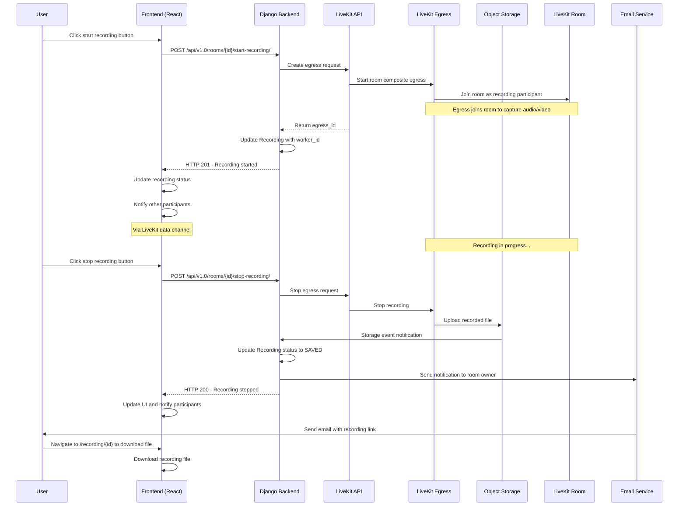

# Room Recording (Beta)

La Suite Meet offers a room recording feature that is currently in beta, with ongoing improvements planned. 

The feature allows users to record their room sessions. When a recording is complete, the room owner receives a notification with a link to download the recorded file. Recordings are automatically deleted after `RECORDING_EXPIRATION_DAYS`.

It uses LiveKit Egress to record room sessions. For reference, see the [LiveKit Egress repository](https://github.com/livekit/egress) and the [official documentation](https://docs.livekit.io/home/egress/overview/).

**Current Limitations**:

* Users cannot record and transcribe simultaneously. ([Issue #527](https://github.com/suitenumerique/meet/issues/527)
 is on our backlog)
* Recording layout cannot be configured from the frontend. By default, the egress captures the active speaker and any shared screens. (not yet planned)
* Shareable links with an embedded video player are not yet supported. (not yet planned)

> [!NOTE]
> Questions? Open an issue on [GitHub](https://github.com/suitenumerique/meet/issues/new?assignees=&labels=bug&template=Bug_report.md) or join our [Matrix community](https://matrix.to/#/#meet-official:matrix.org).


## Special requirements

To use the room recording feature, the following components are required:

- A running [LiveKit Egress](https://github.com/livekit/egress) server capable of handling room composite recordings.
- A S3-compatible object storage that supports webhook events to notify the backend when recordings are uploaded.
- An email service to notify room owners when a recording is available for download.
- Webhook events configured between LiveKit Server and the backend.


> [!CAUTION]
>  Minio supports lifecycle events; other providers may not work out of the box. There is currently a dependency on Minio, which is planned to be refactored in the future.

> [!NOTE]
> Celery isn’t in use for these async tasks yet. It’s something we’d like to add, but it’s not planned at this stage.


## How It Works


```mermaid
sequenceDiagram
    participant User
    participant Frontend as Frontend (React)
    participant Backend as Django Backend
    participant LiveKit as LiveKit API
    participant Egress as LiveKit Egress
    participant Storage as Object Storage
    participant Room as LiveKit Room
    participant Email as Email Service

    User->>Frontend: Click start recording button
    
    Frontend->>Backend: POST /api/v1.0/rooms/{id}/start-recording/
  
    Backend->>LiveKit: Create egress request
    
    LiveKit->>Egress: Start room composite egress
    Egress->>Room: Join room as recording participant
    Note over Egress,Room: Egress joins room to capture audio/video
    
    LiveKit-->>Backend: Return egress_id
    Backend->>Backend: Update Recording with worker_id
    Backend-->>Frontend: HTTP 201 - Recording started
    
    Frontend->>Frontend: Update recording status
    Frontend->>Frontend: Notify other participants
    Note over Frontend: Via LiveKit data channel
    
    Note over Egress,Room: Recording in progress...
    
    User->>Frontend: Click stop recording button
    Frontend->>Backend: POST /api/v1.0/rooms/{id}/stop-recording/
    
    Backend->>LiveKit: Stop egress request
    LiveKit->>Egress: Stop recording
    Egress->>Storage: Upload recorded file
    
    Storage->>Backend: Storage event notification
    Backend->>Backend: Update Recording status to SAVED
    Backend->>Email: Send notification to room owner
    
    Backend-->>Frontend: HTTP 200 - Recording stopped
    Frontend->>Frontend: Update UI and notify participants
    
    Email->>User: Send email with recording link
    User->>Frontend: Navigate to /recording/{id} to download file
    Frontend->>Frontend: Download recording file
```

## Configuration Options

| Option                                  | Type        | Default                                                                                                                                                            | Description                                                                                                                                                                                                                                                                                        |
| --------------------------------------- | ----------- | ------------------------------------------------------------------------------------------------------------------------------------------------------------------ |----------------------------------------------------------------------------------------------------------------------------------------------------------------------------------------------------------------------------------------------------------------------------------------------------|
| **RECORDING_ENABLE**                    | Boolean     | `False`                                                                                                                                                            | Enable or disable the room recording feature.                                                                                                                                                                                                                                                      |
| **RECORDING_OUTPUT_FOLDER**             | String      | `"recordings"`                                                                                                                                                     | Folder/prefix where recordings are stored in the object storage.                                                                                                                                                                                                                                   |
| **RECORDING_WORKER_CLASSES**            | Dict        | `{ "screen_recording": "core.recording.worker.services.VideoCompositeEgressService", "transcript": "core.recording.worker.services.AudioCompositeEgressService" }` | Maps recording types to their worker service classes.                                                                                                                                                                                                                                              |
| **RECORDING_EVENT_PARSER_CLASS**        | String      | `"core.recording.event.parsers.MinioParser"`                                                                                                                       | Class responsible for parsing storage events and updating the backend.                                                                                                                                                                                                                             |
| **RECORDING_ENABLE_STORAGE_EVENT_AUTH** | Boolean     | `True`                                                                                                                                                             | Enable authentication for storage event webhook requests.                                                                                                                                                                                                                                          |
| **RECORDING_STORAGE_EVENT_ENABLE**      | Boolean     | `False`                                                                                                                                                            | Enable handling of storage events (must configure webhook in storage). If `False`, fallback to LiveKit egress complete webhook.                                                    |
| **RECORDING_STORAGE_EVENT_TOKEN**       | Secret/File | `None`                                                                                                                                                             | Token used to authenticate storage webhook requests, if `RECORDING_ENABLE_STORAGE_EVENT_AUTH` is enabled.                                                                                                                                                                                          |
| **RECORDING_EXPIRATION_DAYS**           | Integer     | `None`                                                                                                                                                             | Number of days before recordings expire. Should match bucket lifecycle policy. Set to `None` for no expiration.                                                                                                                                                                                    |
| **RECORDING_MAX_DURATION**              | Integer     | `None`                                                                                                                                                             | Maximum duration of a recording in milliseconds. Must be synced with the LiveKit Egress configuration. Set to None for unlimited duration. When the maximum duration is reached, the recording is automatically stopped and saved, and the user is prompted in the frontend with an alert message. |
| **RECORDING_CUSTOM_ENCODING_ENABLED**          | Boolean     | `False`                                                                                                                                                            | Whether the start-recording API accepts a per-recording `encoding` object (resolution/profile) that overrides the default. When `False`, the API rejects per-recording `encoding`; when `True`, clients may pick from the available resolutions/profiles. The default encoding below is applied regardless of this flag. See [Tuning recording encoding](#tuning-recording-encoding).                                                          |
| **RECORDING_ENCODING_AVAILABLE_RESOLUTIONS** | Dict      | `{"540p": {"width": 960, "height": 540}, "720p": {"width": 1280, "height": 720}, "1080p": {"width": 1920, "height": 1080}}`                                        | Maps a resolution name to its `{"width", "height"}` in pixels. Both the default encoding and the per-recording start-recording API pick from these keys.                                                                                                                                          |
| **RECORDING_ENCODING_AVAILABLE_PROFILES** | Dict      | `{"full": {"fps": 30, "kbps": {…}}, …}`               | Maps a profile name to `{"fps", "kbps": {resolution: video_bitrate_kbps}}`. Every profile must define a bitrate for each available resolution (validated at startup).                                                                                                                              |
| **RECORDING_ENCODING_DEFAULT_RESOLUTION** | String    | `"720p"`                                                                                                                                                          | Resolution used by the default encoding. When set, must be a key of `RECORDING_ENCODING_AVAILABLE_RESOLUTIONS`. Leave unset (together with, or instead of, the default profile) to disable the custom default encoding and fall back to LiveKit's built-in preset (a startup warning is emitted).                                                                                                                                                                  |
| **RECORDING_ENCODING_DEFAULT_PROFILE**  | String    | `"full"`                                                                                                                                                          | Profile used by the default encoding. When set, must be a key of `RECORDING_ENCODING_AVAILABLE_PROFILES`. Leave unset (together with, or instead of, the default resolution) to disable the custom default encoding and fall back to LiveKit's built-in preset (a startup warning is emitted).                                                                                                                                                                        |
| **RECORDING_ENCODING_AUDIO_BITRATE_KBPS** | Integer   | `128`                                                                                                                                                              | AAC audio bitrate in kbps used in the default encoding.                                                                                                                                                                                                               |
| **RECORDING_ENCODING_KEY_FRAME_INTERVAL_S** | Float   | `4.0`                                                                                                                                                              | Keyframe interval in seconds. Drives seek granularity in the recorded MP4 (a player can only seek to keyframe boundaries). Larger values give the encoder slightly more bits for non-keyframe content at a fixed bitrate. `4.0` is a standard VOD value. |


### Manual Storage Webhook

Storage events must be configured manually; the Kubernetes chart does not do this automatically.

1. Configure your S3 bucket to send file creation events to the backend webhook.
2. Enable events and token in settings:

```python
RECORDING_STORAGE_EVENT_ENABLE = True
RECORDING_ENABLE_STORAGE_EVENT_AUTH = True
RECORDING_STORAGE_EVENT_TOKEN = <token>
```

> [!NOTE]
> Questions? Open an issue on [GitHub](https://github.com/suitenumerique/meet/issues/new?assignees=&labels=bug&template=Bug_report.md) or join our [Matrix community](https://matrix.to/#/#meet-official:matrix.org).


## LiveKit Egress

La Suite Meet uses LiveKit Egress to record room sessions. For reference, see the [LiveKit Egress repository](https://github.com/livekit/egress) and the [official documentation](https://docs.livekit.io/home/egress/overview/).

Currently, only `RoomCompositeEgress` is supported. This mode combines all video and audio tracks from the room into a single recording.

To monitor egress workers and inspect recording status, it is recommended to install `livekit-cli`. For example, you can list active egress sessions using the following command:

```bash
$ livekit-cli list-egress

Using default project meet
+-----------------+---------------+----------------+--------------------------------------+--------------------------------+-------+
|    EGRESSID     |    STATUS     |      TYPE      |                SOURCE                |           STARTED AT           | ERROR |
+-----------------+---------------+----------------+--------------------------------------+--------------------------------+-------+
| EG_XXXXXXXXXXXX | EGRESS_ACTIVE | room_composite | your-room-name-XXXXXXXXXXX-XXXXXXXXX | 2024-07-05 18:11:37.073847924  |       |
|                 |               |                |                                      | +0200 CEST                     |       |
+-----------------+---------------+----------------+--------------------------------------+--------------------------------+-------+
```

This allows you to verify which recordings are in progress, troubleshoot egress issues, and confirm that recordings are being processed correctly.

## Tuning recording encoding

Every video recording is encoded from a default resolved from `RECORDING_ENCODING_DEFAULT_PROFILE` + `RECORDING_ENCODING_DEFAULT_RESOLUTION` and passed to LiveKit as advanced `EncodingOptions`. The shipped defaults (`full` profile) match LiveKit's built-in `H264_720P_30` preset. For a one-hour meeting that produces a file of roughly **1.4 GB**, which is often heavier than necessary for talking-head content and screen sharing; lowering the default profile/resolution shrinks it. If either default is left unset, no custom default encoding is built: a warning is logged at startup and LiveKit's built-in preset is used instead.

Encoding is chosen from two maps: `RECORDING_ENCODING_AVAILABLE_RESOLUTIONS` (`resolution → {"width", "height"}`) and `RECORDING_ENCODING_AVAILABLE_PROFILES` (`profile → {"fps", "kbps": {resolution: video_bitrate_kbps}}`):

- **Default**: `RECORDING_ENCODING_DEFAULT_PROFILE` + `RECORDING_ENCODING_DEFAULT_RESOLUTION` set the encoding used by every recording that doesn't override it. Leave either unset to fall back to LiveKit's built-in preset (a startup warning is emitted).
- **Per recording (opt-in)**: set `RECORDING_CUSTOM_ENCODING_ENABLED=True` to let clients override the default per recording. The start-recording API then accepts an `encoding` object selecting a `resolution` (required) and `profile` (optional): a resolution-only request sets the frame size but leaves LiveKit's default framerate/bitrate; adding a profile pins fps and bitrate too. When `RECORDING_CUSTOM_ENCODING_ENABLED=False`, the API rejects any per-recording `encoding` and the default is used.

The resolved values are passed straight through LiveKit's `EncodingOptions.advanced` to the GStreamer pipeline (`x264enc` for video, `faac` for audio), so there are no hidden conversions — what the profile/resolution resolve to is what the encoder receives.

### How values map to GStreamer

| Resolved value                            | GStreamer element | Property                           |
| ----------------------------------------- | ----------------- | ---------------------------------- |
| resolution `width` / `height`             | capsfilter        | `video/x-raw,width=W,height=H`     |
| profile `fps`                             | capsfilter        | `framerate=F/1`                    |
| profile `kbps[resolution]`                | `x264enc`         | `bitrate=kbps` (kilobits)          |
| `RECORDING_ENCODING_KEY_FRAME_INTERVAL_S` | `x264enc`         | `key-int-max = interval × fps`     |
| `RECORDING_ENCODING_AUDIO_BITRATE_KBPS`   | `faac`            | `bitrate = kbps × 1000` (bits)     |

The H.264 profile is fixed to MAIN and the x264 `speed-preset` to `veryfast` by LiveKit (real-time constraint) — lowering the framerate is therefore the main lever to save CPU, while lowering the bitrate is the main lever to shrink the output file.

### Built-in profiles

The default `RECORDING_ENCODING_AVAILABLE_PROFILES` ship four profiles. Framerate is fixed per profile; video bitrate (kbps) scales with resolution so quality stays consistent across sizes. File size scales roughly with `framerate × bitrate`, and so does egress CPU cost.

| Profile         | FPS | 540p (kbps) | 720p (kbps) | 1080p (kbps) | Suitable for                                       |
| --------------- | --- | ----------- | ----------- | ------------ | -------------------------------------------------- |
| `talking_heads` | 15  | 400         | 700         | 1200         | Talking-head dominant meetings + occasional slides |
| `text`          | 15  | 600         | 1000        | 1800         | Frequent dense screen sharing (decks, IDE, docs)   |
| `mixed`         | 20  | 900         | 1500        | 2500         | Mixed content, moderate motion                     |
| `full`          | 30  | 2000        | 3000        | 4500         | Highest fidelity; closest to the LiveKit preset    |

To pick a profile per recording (requires `RECORDING_CUSTOM_ENCODING_ENABLED=True`), the client sends it in the start-recording request:

```json
{
  "mode": "screen_recording",
  "options": {"encoding": {"resolution": "720p", "profile": "talking_heads"}}
}
```

To change the default encoding applied to every recording:

```bash
RECORDING_ENCODING_DEFAULT_RESOLUTION=720p
RECORDING_ENCODING_DEFAULT_PROFILE=talking_heads
RECORDING_ENCODING_AUDIO_BITRATE_KBPS=64
RECORDING_ENCODING_KEY_FRAME_INTERVAL_S=4.0
```

### Caveats

- **Screen-share readability — think bits/frame, not bitrate**: at 720p, text legibility starts to break down below ~40 kbits/frame (= `bitrate ÷ framerate`). The `talking_heads` profile (700 kbps × 15 fps) sits just above that threshold, comfortable for talking heads with occasional slide sharing. The same bitrate at 30 fps would only deliver ~23 kbits/frame and visibly blur dense slides — which is why **lowering framerate is a more screen-share-friendly lever than lowering bitrate**. For deck-heavy or IDE-share meetings, prefer the **`text`** profile (1000 kbps × 15 fps ≈ 67 kbits/frame).
- **Motion handling**: the `veryfast` x264 preset is set by LiveKit and cannot be overridden here. Low-bitrate settings will therefore show more artefacts on fast motion than an offline re-encode with a slower preset would. This is the other reason FPS reduction is the safer tuning lever for meeting recordings.
- **Audio**: AAC at 64 kbps stereo is transparent for voice but starts to compress music noticeably. Keep 128 kbps if you expect music playback in meetings.
- **Codec choice**: H.264 MAIN is hardcoded on purpose. Switching to HEVC or VP9 would increase egress CPU cost 2×–5×, defeating the goal of this tuning.
