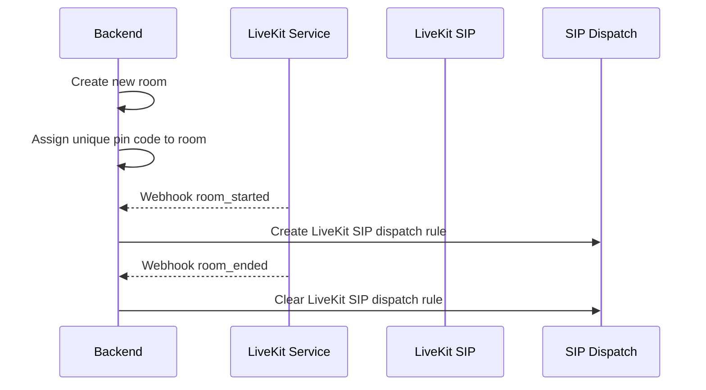
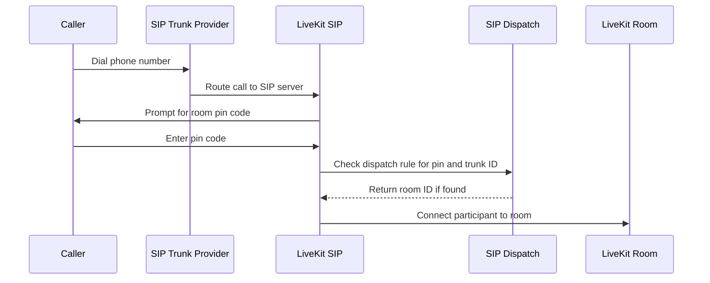

# Telephony SIP (Beta)

Enable participants to join a video conference via phone, allowing them to participate in the room even when their internet connection is poor or unavailable.

**Current Limitations**:

* Supports only a single SIP trunk provider per instance.
* A participant joining over the phone cannot enter the room until the first WebRTC participant has connected.

## Special requirements

To use the telephony feature, the following components are required:
* A running [LiveKit SIP server](https://github.com/livekit/sip) ([documentation](https://docs.livekit.io/home/self-hosting/sip-server/)) to handle SIP participants and connect them to room sessions.
* A SIP trunk to route incoming and outgoing phone calls.
* Webhook events configured between the LiveKit server and the backend.

## How It Works

### Room Lifecycle

### Participant calling

## Configuration

| Option                         | Type             | Default | Description                                                                                                     |
| ------------------------------ | ---------------- | ------- |-----------------------------------------------------------------------------------------------------------------|
| ROOM_TELEPHONY_ENABLED         | Boolean          | False   | Enable or disable telephony (phone call) support for rooms.                                                     |
| ROOM_TELEPHONY_PIN_LENGTH      | Positive Integer | 10      | Length of the PIN code participants must enter to join a call.                                                  |
| ROOM_TELEPHONY_PIN_MAX_RETRIES | Positive Integer | 5       | Maximum number of attempts a participant can make when entering the PIN.                                        |
| ROOM_TELEPHONY_PHONE_NUMBER    | String           | None    | The phone number associated with the room for incoming calls. Required to route calls via the telephony system. |
| ROOM_TELEPHONY_DEFAULT_COUNTRY | String           | "US"    | Default country code for phone numbers, used for parsing and formatting phone numbers.                          |

### SIP Trunk Authentication

You may need to configure authentication between LiveKit SIP and your SIP trunk provider to enable participants to join via phone.
Please refer to [the official documentation](https://docs.livekit.io/sip/quickstarts/configuring-sip-trunk/).

> [!NOTE]
> Questions? Open an issue on [GitHub](https://github.com/suitenumerique/meet/issues/new?assignees=&labels=bug&template=Bug_report.md) or join our [Matrix community](https://matrix.to/#/#meet-official:matrix.org).

### Language Customization for Audio Prompts

You may need to configure the default LiveKit voice to match your locale. By default, all LiveKit audio instructions are in English.
To customize the prompts, mount the appropriate audio files as a volume in your deployment. The audio resources are available here: [LiveKit SIP audio files](https://github.com/livekit/sip/tree/main/res).

## Documentation

For detailed information on integrating and configuring SIP with LiveKit, refer to the official LiveKit SIP documentation: [LiveKit SIP Documentation](https://docs.livekit.io/sip/). This guide covers SIP server setup, trunk configuration, dispatch rules, etc.
