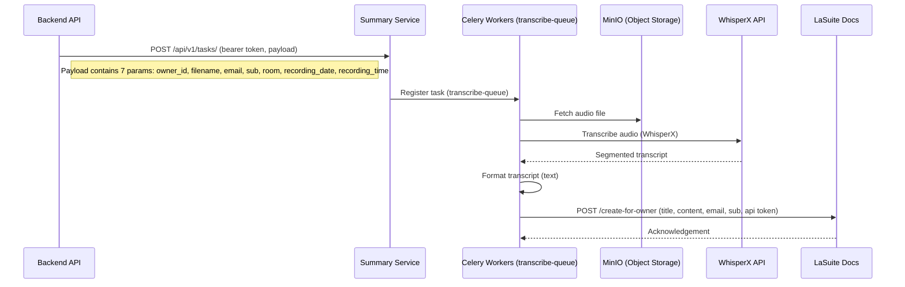

# Transcription

La Suite Meet provides a room transcription capability, currently available in beta. This feature is under active development, with ongoing enhancements planned.

The transcription feature enables users to record room sessions. Upon completion of a recording, the room owner receives a notification containing a link to LaSuite Docs, where the transcribed meeting content can be accessed.

> [!NOTE]
> Audio recordings are automatically deleted after the configured `RECORDING_EXPIRATION_DAYS` period.

For configuration and setup details of the recording functionality, refer to the [Recording feature documentation](https://github.com/suitenumerique/meet/blob/main/docs/features/recording.md).
This page only describes the supplementary tools required for audio processing.

Example of a transcript : 

```
**SPEAKER_00**: Hello everyone!
**SPEAKER_01**: Yes, it works.
```


### Current Limitations

* Participant identification is not yet implemented; participants are labeled generically (e.g., `PARTICIPANT_1`).
* Transcription backend relies on [WhisperX](https://github.com/m-bain/whisperX), which does not provide an OpenAI-compatible API.

> [!NOTE]
> Questions? Open an issue on [GitHub](https://github.com/suitenumerique/meet/issues/new?assignees=&labels=bug&template=Bug_report.md) or join our [Matrix community](https://matrix.to/#/#meet-official:matrix.org).

## Special requirements

To enable the transcription feature, the following components must be in place:

* Recording feature components: All dependencies and configurations required for the [recording feature](https://github.com/suitenumerique/meet/blob/main/docs/features/recording.md).
* LaSuite Docs instance: A running [LaSuite Docs](https://github.com/suitenumerique/docs) capable of handling requests to the `/create-for-owner` endpoint.
* WhisperX API: A running WhisperX service. An open-source implementation combining WhisperX and FastAPI is available [here](https://github.com/suitenumerique/meet-whisperx).
* Deployment of the [summary service](https://hub.docker.com/r/lasuite/meet-summary), a Celery worker, and a Redis instance.

## How It Works



## Configuration Options

| Option                   | Type      | Default                                                               | Description                                                                                                                                                             |
| ------------------------ | --------- |-----------------------------------------------------------------------|-------------------------------------------------------------------------------------------------------------------------------------------------------------------------|
| app_name                 | String    | `"app"`                                                               | Name of the application/service.                                                                                                                                        |
| app_api_v1_str           | String    | `"/api/v1"`                                                           | Base path for the API endpoints.                                                                                                                                        |
| app_api_token            | Secret    | —                                                                     | API token for authenticating requests.                                                                                                                                  |
| recording_max_duration   | Integer   | `None`                                                                | Maximum duration of audio recordings in milliseconds. Set to `None` for unlimited. Audio recordings longer than the configured limit will be ignored and not processed. |
| celery_broker_url        | String    | `"redis://redis/0"`                                                   | Celery broker URL.                                                                                                                                                      |
| celery_result_backend    | String    | `"redis://redis/0"`                                                   | Celery result backend URL.                                                                                                                                              |
| celery_max_retries       | Integer   | `1`                                                                   | Maximum number of retries for Celery tasks.                                                                                                                             |
| transcribe_queue         | String    | `"transcribe-queue"`                                                  | Name of the Celery queue for transcription tasks.                                                                                                                       |
| aws_storage_bucket_name  | String    | —                                                                     | Name of the S3/MinIO bucket used for storing recordings.                                                                                                                |
| aws_s3_endpoint_url      | String    | —                                                                     | Endpoint URL of the S3/MinIO storage.                                                                                                                                   |
| aws_s3_access_key_id     | String    | —                                                                     | Access key for S3/MinIO.                                                                                                                                                |
| aws_s3_secret_access_key | Secret    | —                                                                     | Secret key for S3/MinIO.                                                                                                                                                |
| aws_s3_secure_access     | Boolean   | `True`                                                                | Use HTTPS for S3/MinIO requests.                                                                                                                                        |
| whisperx_api_key         | Secret    | —                                                                     | API key for accessing WhisperX.                                                                                                                                         |
| whisperx_base_url        | String    | `"https://api.whisperx.com/v1"`                                       | Base URL for the WhisperX API.                                                                                                                                          |
| whisperx_asr_model       | String    | `"whisper-1"`                                                         | ASR model used for transcription.                                                                                                                                       |
| whisperx_max_retries     | Integer   | `0`                                                                   | Maximum number of retries for WhisperX API requests.                                                                                                                    |
| webhook_max_retries      | Integer   | `2`                                                                   | Maximum retries for webhook requests.                                                                                                                                   |
| webhook_status_forcelist | List[Int] | `[502, 503, 504]`                                                     | HTTP status codes triggering webhook retry.                                                                                                                             |
| webhook_backoff_factor   | Float     | `0.1`                                                                 | Exponential backoff factor for webhook retries.                                                                                                                         |
| webhook_api_token        | Secret    | —                                                                     | Token to authenticate incoming webhook requests.                                                                                                                        |
| webhook_url              | String    | —                                                                     | URL to which webhook events are sent.                                                                                                                                   |
| document_default_title   | String    | `"Transcription"`                                                     | Default title for generated documents.                                                                                                                                  |
| document_title_template  | String    | `'Réunion "{room}" du {room_recording_date} à {room_recording_time}'` | Template for document title.                                                                                                                                            |
| sentry_is_enabled        | Boolean   | `False`                                                               | Enable or disable Sentry error tracking.                                                                                                                                |
| sentry_dsn               | String    | `None`                                                                | DSN for Sentry integration.                                                                                                                                             |
