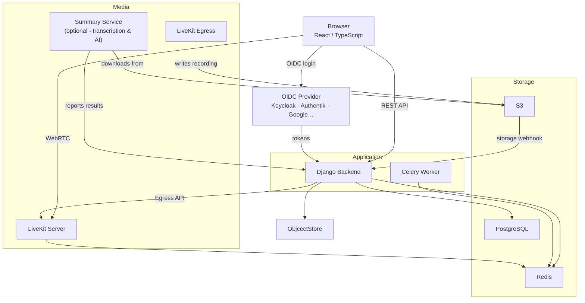
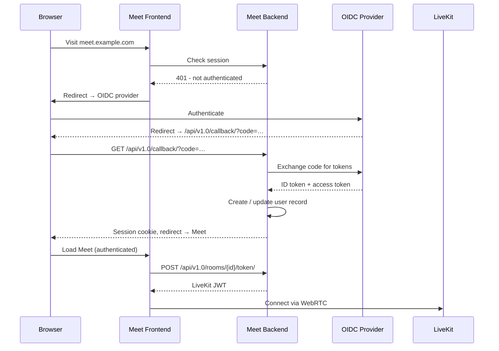
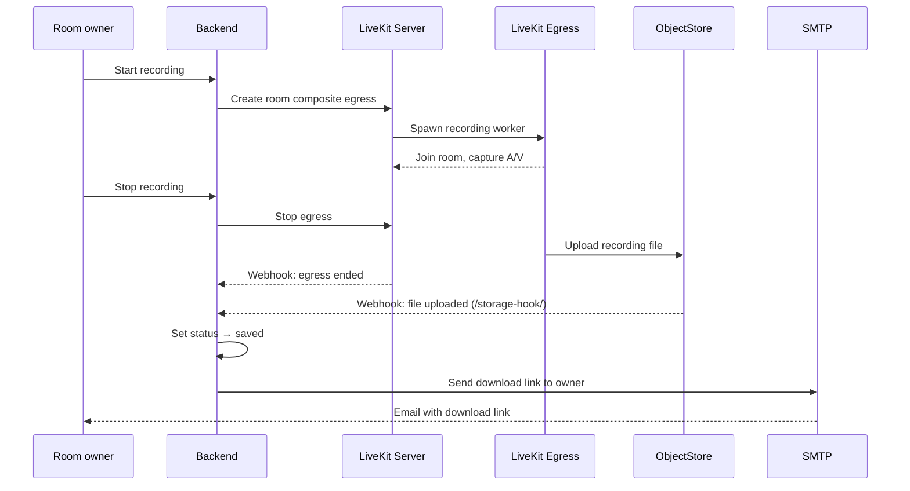

# Architecture

LaSuite Meet is a multi-service application. Understanding its components helps you deploy it correctly and debug issues when they arise.

## Components overview

## Services

### React Frontend

- **Technology**: TypeScript, React, Vite.js, React Aria (Adobe)
- **Role**: The browser-based UI. Connects to the Django backend via REST for authentication, room management, and recording state. Connects directly to LiveKit using the LiveKit JavaScript SDK for all real-time media (video, audio, screen sharing, chat).
- **Port**: 3000 (dev) / 8080 (production container)

### Django Backend

- **Technology**: Python 3.13+, Django 5.x, Django REST Framework, Celery
- **Role**: Central API server. Handles:
  - User authentication (OIDC/OAuth2)
  - Room creation and access control
  - Issuing LiveKit JWT tokens to clients
  - Recording lifecycle management (start/stop/webhook)
  - S3 webhook processing from ObjectStore
- **Port**: 8000

### LiveKit Server

- **Technology**: Go (open source, by LiveKit Inc.)
- **Role**: The WebRTC Selective Forwarding Unit (SFU). Receives media streams from participants and selectively forwards them. Handles all real-time signaling, simulcast, codec negotiation, and TURN/STUN.
- **Ports**: 7880 (HTTP/WebSocket), 7881 (TCP), 7882/UDP (RTP/RTCP)

### LiveKit Egress

- **Technology**: Go (open source, by LiveKit Inc.)
- **Role**: Records rooms or individual tracks to files. Saves output to ObjectStore. Triggered by the Django backend via LiveKit's Egress API.
- **Dependency**: Requires Redis (shared with LiveKit server)

### Summary Service

- **Technology**: Python, FastAPI, Celery
- **Role**: Optional AI service for transcription and meeting summarization. Uses Whisper (or compatible STT engines) for speech-to-text, and an LLM API for summarization. Runs two separate Celery queues: `transcribe-queue` and `summarize-queue`.
- **Port**: 8000 (internal)

### Metadata Collector Agent

- **Technology**: Python (LiveKit Agents SDK)
- **Role**: Connects to LiveKit rooms and collects metadata events: Voice Activity Detection (VAD), participant connection/disconnection events, chat messages. Stores metadata in object storage for later processing by the summary service.

## Backing services

| Service | Purpose | Default port |
|---|---|---|
| PostgreSQL 16 | Relational data (users, rooms, recordings) | 5432 |
| Redis 5+ | Celery broker, LiveKit state, session cache | 6379 |
| ObjectStore / S3-compatible | Object storage for recordings and uploads | 9000 |

## Authentication flow

## Recording flow

## Transcription flow (beta)

1. Recording completes (or transcription is started independently)
2. Django backend triggers the Summary service with the audio/video file location
3. Summary service downloads the file from object storage
4. Celery worker on `transcribe-queue` runs Whisper STT
5. Celery worker on `summarize-queue` calls the configured LLM API
6. Results are stored and made available for download via the Django API
