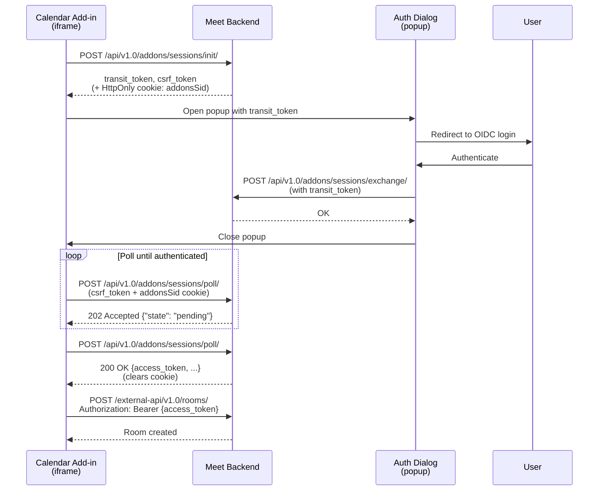

# External API - Calendar Add-ons Auth

Meet exposes an external API at `/external-api/v1.0/` for server-to-server room management. This page covers the **calendar add-ons** authentication mode, used by calendar integrations (Outlook, etc.) running in embedded iframes.

Enable this mode with `ADDONS_ENABLED=True` on the backend.

---

## When to use this mode

Use add-ons authentication when:

- You're building a calendar add-in that runs in an iframe
- You need to obtain an access token without exposing it to client-side JavaScript
- The user authenticates with Meet's OIDC provider

Compare with [Application-Delegated](external-api-delegated.md) (your backend acts on behalf of users) and [Resource Server](external-api-resource-server.md) (user presents their OIDC token directly).

---

## Authentication flow

The add-ons flow uses a three-step token exchange:



---

## Step 1: Initialize session

```http
POST /api/v1.0/addons/sessions/init/
```

**Response (201):**
```json
{
  "transit_token": "abc123...",
  "csrf_token": "def456..."
}
```

The backend sets an `HttpOnly`, `Secure`, `SameSite=None` cookie named `addonsSid`.

---

## Step 2: Exchange transit token

After the user authenticates in a popup, the callback page calls:

```http
POST /api/v1.0/addons/sessions/exchange/
Content-Type: application/json
```

```json
{
  "transit_token": "abc123..."
}
```

**Response (200):**
```json
{"status": "ok"}
```

This binds the authenticated user's access token to the session. Transit tokens are single-use.

---

## Step 3: Poll for access token

```http
POST /api/v1.0/addons/sessions/poll/
X-CSRFToken: def456...
Cookie: addonsSid=...
```

**While pending (202):**
```json
{"state": "pending"}
```

**When ready (200):**
```json
{
  "state": "authenticated",
  "access_token": "eyJhbGci...",
  "token_type": "Bearer",
  "expires_in": 3600,
  "scope": "external_api"
}
```

The session is deleted and the cookie cleared after this final read.

---

## Using the access token

```http
POST /external-api/v1.0/rooms/
Authorization: Bearer eyJhbGci...
Content-Type: application/json
```

```json
{
  "name": "Team Meeting",
  "access_level": "public"
}
```

---

## Backend configuration

| Variable | Required | Default | Description |
|----------|----------|---------|-------------|
| `ADDONS_ENABLED` | Yes | `False` | Enable add-ons authentication |
| `ADDONS_TOKEN_SECRET_KEY` | Yes | - | Secret for signing JWT tokens |
| `ADDONS_CSRF_SECRET` | Yes | - | Secret for CSRF token derivation |
| `ADDONS_TOKEN_SCOPE` | No | `rooms:create` | Scope in issued tokens |
| `ADDONS_SESSION_TTL` | No | `3600` | Session lifetime in seconds |
| `ADDONS_TRANSIT_TOKEN_TTL` | No | `120` | Transit token lifetime in seconds |
| `ADDONS_TOKEN_TTL` | No | `7200` | Access token lifetime in seconds |
| `ADDONS_TOKEN_ISSUER` | No | `lasuite-meet` | JWT issuer claim |
| `ADDONS_TOKEN_AUDIENCE` | No | `addons` | JWT audience claim |

---

## Implementation reference

See `src/addons/outlook/` for a working example. The Outlook add-in uses this flow to create meeting rooms and insert the link into calendar events.

Implementation details:
- Session management: `src/backend/core/addons/service.py`
- API endpoints: `src/backend/core/addons/viewsets.py`
- Frontend example: `src/addons/outlook/src/common/api.js`
