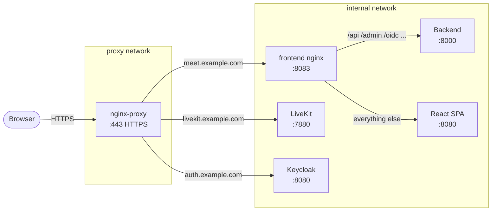

# Reverse Proxy: nginx-proxy

nginx-proxy + acme-companion is a Docker-native reverse proxy that automatically issues Let's Encrypt certificates for any container that declares a `VIRTUAL_HOST` environment variable. It is the simplest option for new deployments on a single server.

> Prefer Traefik? See [Reverse Proxy: Traefik](traefik.md).

!!! warning
    These instructions are provided as a quick-start example. For production environments, follow the [official nginx-proxy documentation](https://github.com/nginx-proxy/nginx-proxy/tree/main/docs) and the [acme-companion documentation](https://github.com/nginx-proxy/acme-companion/tree/main/docs). In particular: review the security implications of mounting the Docker socket, and consider whether a more explicit reverse proxy configuration suits your environment better.

---

## How it works

nginx-proxy runs as its own Docker Compose stack, permanently attached to the `proxy` Docker network. Any container on that network with a `VIRTUAL_HOST` variable gets automatically routed and gets a TLS certificate. No config files to write - the proxy reconfigures itself when containers start or stop.

Meet uses a two-layer routing setup:

1. **nginx-proxy** (outer) - terminates TLS, routes by hostname
2. **frontend container nginx** (inner) - routes by URL path between the Django backend, the React SPA, and MinIO



---

## Step 1: Create the proxy network

This network is shared between nginx-proxy and all other stacks. Create it once:

```bash
docker network create proxy
```

---

## Step 2: Set up nginx-proxy

```bash
mkdir -p ~/docker/nginx-proxy && cd ~/docker/nginx-proxy

RAW="https://raw.githubusercontent.com/suitenumerique/meet/main"

curl -fsSL -o compose.yml  ${RAW}/docs/docs/examples/nginx-proxy/compose.yml
curl -fsSL -o .env         ${RAW}/docs/docs/examples/nginx-proxy/.env.example
```

Edit `.env` - set your email for Let's Encrypt expiry notifications:

```dotenv
LETSENCRYPT_EMAIL=you@example.com
```

Start:

```bash
docker compose up -d
```

nginx-proxy is now listening on ports 80 and 443. Any container that joins the `proxy` network with a `VIRTUAL_HOST` variable will be picked up automatically.

---

## Step 3: How Meet services integrate

Meet's three public-facing services each declare their own virtual host. This is handled by the proxy override file (`docker-compose.override.yml`) in each stack - you don't need to edit it manually. This section explains what it does.

### Meet frontend

The frontend container runs an internal nginx on port 8083 that routes traffic between the backend API and the React SPA. nginx-proxy terminates TLS and forwards everything for `meet.example.com` to port 8083:

```yaml
frontend:
  environment:
    VIRTUAL_HOST: ${MEET_HOST}
    VIRTUAL_PORT: "8083"
    LETSENCRYPT_HOST: ${MEET_HOST}
    LETSENCRYPT_EMAIL: ${LETSENCRYPT_EMAIL}
  networks:
    - proxy
    - internal
```

### LiveKit

LiveKit's WebSocket signaling must be served over WSS (TLS). nginx-proxy handles TLS termination on port 443 and forwards the WebSocket connection to LiveKit on port 7880. Media ports (7881/TCP, 7882/UDP) bypass nginx entirely - they are mapped directly on the host:

```yaml
livekit:
  environment:
    VIRTUAL_HOST: ${LIVEKIT_HOST}
    VIRTUAL_PORT: "7880"
    LETSENCRYPT_HOST: ${LIVEKIT_HOST}
    LETSENCRYPT_EMAIL: ${LETSENCRYPT_EMAIL}
  ports:
    - "7881:7881/tcp"
    - "7882:7882/udp"
  networks:
    - proxy
    - internal
```

### Keycloak

Keycloak needs its own subdomain so the browser can reach it for the OIDC login redirect:

```yaml
keycloak:
  environment:
    VIRTUAL_HOST: ${IDP_HOST}
    VIRTUAL_PORT: "8080"
    LETSENCRYPT_HOST: ${IDP_HOST}
    LETSENCRYPT_EMAIL: ${LETSENCRYPT_EMAIL}
  networks:
    - proxy
    - internal
```

### Backend

The backend does **not** get a `VIRTUAL_HOST`. It is only reached via the frontend container's internal nginx. It still needs to be on the `proxy` network so it can resolve public hostnames (`auth.example.com`, `livekit.example.com`) for OIDC token exchange and LiveKit API calls:

```yaml
backend:
  networks:
    - proxy
    - internal
```

---

## Step 4: DNS

Before starting Meet, create three DNS A records pointing to your server:

| Record | Purpose |
|---|---|
| `meet.example.com` | Meet frontend + API |
| `auth.example.com` | Keycloak |
| `livekit.example.com` | LiveKit WebSocket |

All three must resolve before you start the stack - Let's Encrypt verifies DNS during certificate issuance.

---

## Verification

After all stacks are running, confirm TLS is working:

```bash
curl -s -o /dev/null -w "%{http_code}" https://meet.example.com/
curl -s -o /dev/null -w "%{http_code}" https://auth.example.com/
curl -s -o /dev/null -w "%{http_code}" https://livekit.example.com/
# All should return 200
```

Check nginx-proxy logs if a certificate hasn't been issued yet:

```bash
cd ~/docker/nginx-proxy
docker compose logs acme-companion | grep -i "cert\|error\|challenge"
```

---

## Troubleshooting

**502 Bad Gateway for Meet**
The frontend container is not listening on port 8083, or the `nginx-routing.conf` file is not mounted correctly. Check:
```bash
docker compose -f ~/docker/meet/compose.yml logs frontend
```
Verify `nginx-routing.conf` is mounted to `/etc/nginx/conf.d/routing.conf:ro` in the frontend service.

**Infinite redirect loop (301)**
`X-Forwarded-Proto` is not set correctly in `nginx-routing.conf`. The file must hardcode `proxy_set_header X-Forwarded-Proto https;` - not `$scheme`.

**Certificate not being issued**
- Port 80 must be publicly reachable for the HTTP-01 ACME challenge
- DNS must resolve to your server before nginx-proxy starts
- Check: `docker compose -f ~/docker/nginx-proxy/compose.yml logs acme-companion`

**Login redirects to Keycloak but token exchange fails**
The Meet backend cannot reach `auth.example.com`. Ensure the `backend` service is on the `proxy` network in `~/docker/meet/compose.yml`.

**Port conflict on 80 or 443**
Another process is already bound to these ports. Find it:
```bash
ss -tlpn | grep -E ':80|:443'
```
Stop it before starting nginx-proxy.
