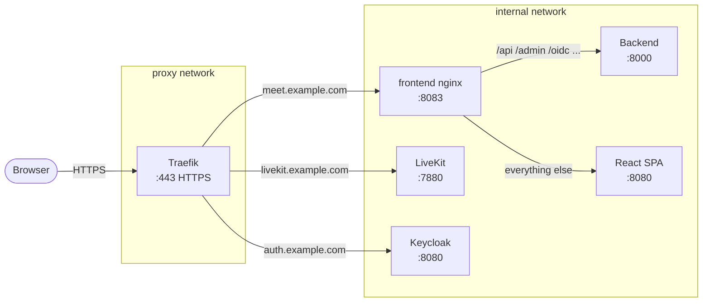

# Reverse Proxy: Traefik

Traefik is a modern reverse proxy that integrates natively with Docker. Services declare their own routing rules via container labels; Traefik picks them up automatically and issues Let's Encrypt certificates without any additional configuration.

> Prefer nginx-proxy? See [Reverse Proxy: nginx-proxy](nginx.md).

!!! warning
    These instructions are provided as a quick-start example. For production environments, follow the [official Traefik documentation](https://doc.traefik.io/traefik/). In particular: review the security implications of mounting the Docker socket, consider using a more restrictive provider configuration, and evaluate whether the static file provider suits your setup better than the Docker provider.

---

## How it works

Traefik runs as its own Docker Compose stack, permanently attached to the `proxy` Docker network. Any container on that network with `traefik.enable=true` labels gets automatically routed and receives a TLS certificate. No config files to write - Traefik reconfigures itself when containers start or stop.

Meet uses a two-layer routing setup:

1. **Traefik** (outer) - terminates TLS, routes by hostname
2. **frontend container nginx** (inner) - routes by URL path between the Django backend, the React SPA, and MinIO



---

## Step 1: Create the proxy network

This network is shared between Traefik and all other stacks. Create it once:

```bash
docker network create proxy
```

---

## Step 2: Set up Traefik

```bash
mkdir -p ~/docker/traefik && cd ~/docker/traefik
touch acme.json && chmod 600 acme.json

RAW="https://raw.githubusercontent.com/suitenumerique/meet/main"

curl -fsSL -o compose.yml  ${RAW}/docs/examples/traefik/compose.yml
```

> `acme.json` stores Let's Encrypt certificates. It must exist with mode `600` before Traefik starts - Traefik refuses to start with any other permission.

Create `.env` and set your email for Let's Encrypt expiry notifications:

```dotenv
LETSENCRYPT_EMAIL=you@example.com
```

Start:

```bash
docker compose up -d
```

Traefik is now listening on ports 80 and 443. Any container that joins the `proxy` network with `traefik.enable=true` labels will be picked up automatically.

---

## Step 3: How Meet services integrate

Meet's three public-facing services each declare their own Traefik labels. This is handled by the proxy override file (`docker-compose.override.yml`) in each stack - you don't need to edit it manually. This section explains what it does.

### Meet frontend

The frontend container runs an internal nginx on port 8083 that routes traffic between the backend API and the React SPA. Traefik terminates TLS and forwards everything for `meet.example.com` to port 8083:

```yaml
frontend:
  labels:
    traefik.enable: "true"
    traefik.http.routers.meet-frontend.rule: "Host(`${MEET_HOST}`)"
    traefik.http.routers.meet-frontend.entrypoints: websecure
    traefik.http.routers.meet-frontend.tls: "true"
    traefik.http.routers.meet-frontend.tls.certresolver: letsencrypt
    traefik.http.services.meet-frontend.loadbalancer.server.port: "8083"
  networks:
    - proxy
    - internal
```

### LiveKit

LiveKit's WebSocket signaling must be served over WSS (TLS). Traefik handles TLS termination on port 443 and forwards the WebSocket connection to LiveKit on port 7880. Traefik supports WebSocket upgrades automatically - no additional configuration needed. Media ports (7881/TCP, 7882/UDP) bypass Traefik entirely - they are mapped directly on the host:

```yaml
livekit:
  labels:
    traefik.enable: "true"
    traefik.http.routers.meet-livekit.rule: "Host(`${LIVEKIT_HOST}`)"
    traefik.http.routers.meet-livekit.entrypoints: websecure
    traefik.http.routers.meet-livekit.tls: "true"
    traefik.http.routers.meet-livekit.tls.certresolver: letsencrypt
    traefik.http.services.meet-livekit.loadbalancer.server.port: "7880"
  ports:
    - "7881:7881/tcp"
    - "7882:7882/udp"
  networks:
    - proxy
    - internal
```

### Keycloak

Keycloak needs its own subdomain so the browser can reach it for the OIDC login redirect:

```yaml
keycloak:
  labels:
    traefik.enable: "true"
    traefik.http.routers.keycloak.rule: "Host(`${IDP_HOST}`)"
    traefik.http.routers.keycloak.entrypoints: websecure
    traefik.http.routers.keycloak.tls: "true"
    traefik.http.routers.keycloak.tls.certresolver: letsencrypt
    traefik.http.services.keycloak.loadbalancer.server.port: "8080"
  networks:
    - proxy
    - internal
```

### Backend

The backend does **not** get Traefik labels. It is only reached via the frontend container's internal nginx. It still needs to be on the `proxy` network so it can resolve public hostnames (`auth.example.com`, `livekit.example.com`) for OIDC token exchange and LiveKit API calls:

```yaml
backend:
  networks:
    - proxy
    - internal
```

---

## Step 4: DNS

Before starting Meet, create three DNS A records pointing to your server:

| Record | Purpose |
|---|---|
| `meet.example.com` | Meet frontend + API |
| `auth.example.com` | Keycloak |
| `livekit.example.com` | LiveKit WebSocket |

All three must resolve before you start the stack - Let's Encrypt verifies DNS during certificate issuance.

---

## Verification

After all stacks are running, confirm Traefik has discovered all routes:

```bash
docker logs traefik 2>&1 | grep -i "router\|certificate\|acme" | tail -20
```

Confirm TLS is working:

```bash
curl -s -o /dev/null -w "%{http_code}" https://meet.example.com/
curl -s -o /dev/null -w "%{http_code}" https://auth.example.com/
curl -s -o /dev/null -w "%{http_code}" https://livekit.example.com/
# All should return 200
```

---

## Troubleshooting

**Traefik refuses to start: "acme.json has too open permissions"**
```bash
chmod 600 ~/docker/traefik/acme.json && docker compose restart traefik
```

**502 Bad Gateway for a service**
The container is not on the `proxy` network. Verify the service has `proxy` in its `networks:` list and recreate it:
```bash
docker compose up -d --force-recreate <service>
```

**Route missing / service returns 404**
`traefik.enable=true` label is missing. Since `--providers.docker.exposedByDefault=false` is set, containers must opt in explicitly. Add the label and recreate the container.

**Certificate not being issued**
- Port 80 must be publicly reachable for the HTTP-01 ACME challenge
- DNS must resolve to your server before Traefik starts
- Check: `docker logs traefik | grep -i "acme\|certificate\|error"`

**Login redirects to Keycloak but token exchange fails**
The Meet backend cannot reach `auth.example.com`. Ensure the `backend` service is on the `proxy` network in `~/docker/meet/compose.yml`.

**Port conflict on 80 or 443**
Another process is already bound to these ports. Find it:
```bash
ss -tlpn | grep -E ':80|:443'
```
Stop it before starting Traefik.
