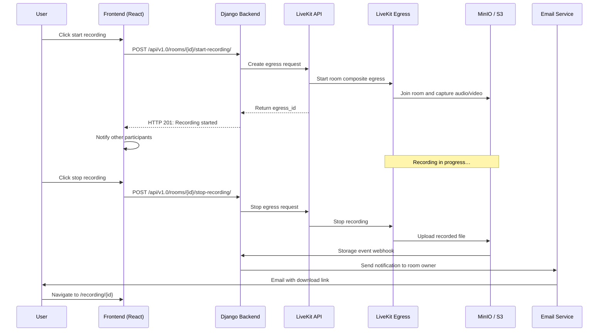

# Recording

Room recording is available in beta. The feature lets users record their sessions; when a recording is complete, the room owner receives an email with a download link. Recordings are deleted automatically after `RECORDING_EXPIRATION_DAYS` if set.

Meet uses [LiveKit Egress](https://github.com/livekit/egress) to capture room audio and video and upload the result to S3-compatible storage.

**Known limitations:**

- Recording layout is not configurable from the frontend. Egress captures the active speaker and any shared screens by default
- Shareable links with an embedded video player are not yet supported

## How it works



## Requirements

- A running LiveKit Egress server
- S3-compatible object storage with bucket event notifications
- SMTP service for email notifications to room owners
- LiveKit webhook configured to reach the Meet backend

!!!warning
    An S3-compatible object storage with bucket event notifications is required. As an example we use MinIO but in production MinIO is not recommanded as the open source community version is not maintained anymore. This dependency is planned to be refactored in a future release see [PR #1386](https://github.com/suitenumerique/meet/pull/1386)

---

## Docker Compose setup

### Step 1: Configure MinIO

[MinIO](https://min.io/) provides S3-compatible storage with the bucket event notifications Meet requires.

Add to your `compose.yml`:

```yaml
minio:
  image: minio/minio:latest
  restart: unless-stopped
  command: server /data --console-address ":9001"
  environment:
    MINIO_ROOT_USER: minioadmin
    MINIO_ROOT_PASSWORD: minioadmin123
  volumes:
    - minio_data:/data
  networks:
    - proxy   # must be on proxy to reach the reverse proxy for webhook delivery
    - internal

volumes:
  minio_data:
```

### Step 2: Initialize the bucket

Create a one-time init container to set up the bucket and public access:

```yaml
minio-init:
  image: minio/mc:latest
  restart: "no"
  depends_on:
    - minio
  entrypoint: ["/bin/sh", "-c"]
  command:
    - "sleep 5 && mc alias set myminio http://minio:9000 minioadmin minioadmin123 && mc mb myminio/meet-media-storage --ignore-existing && mc anonymous set download myminio/meet-media-storage"
  networks:
    - internal
```

Run the init container:

```bash
docker compose up -d minio-init
```

### Step 3: Configure bucket event notifications

MinIO must notify the Meet backend when a recording file is uploaded. Complete these three sub-steps in order.

**1. Register the webhook target** (replace `<project>` with your Compose project name, typically the directory name):

```bash
docker run --rm --network <project>_internal --entrypoint /bin/sh minio/mc:latest -c \
  "mc alias set myminio http://minio:9000 minioadmin minioadmin123 && \
   mc admin config set myminio notify_webhook:recordings endpoint='https://meet.example.com/api/v1.0/recordings/storage-hook/' queue_limit=10"
```

**2. Restart MinIO** (the webhook target is only active after a restart):

```bash
docker compose restart minio && sleep 5
```

**3. Subscribe the bucket to the webhook:**

```bash
docker run --rm --network <project>_internal --entrypoint /bin/sh minio/mc:latest -c \
  "mc alias set myminio http://minio:9000 minioadmin minioadmin123 && \
   mc event add myminio/meet-media-storage arn:minio:sqs::recordings:webhook --event put --prefix recordings/"
```

### Step 4: Set up LiveKit Egress

Create `livekit-egress.yaml`:

```yaml
api_key: meet
api_secret: your-livekit-api-secret
ws_url: ws://livekit:7880

redis:
  address: redis:6379

s3:
  access_key: minioadmin
  secret: minioadmin123
  endpoint: http://minio:9000
  bucket: meet-media-storage
  region: us-east-1  # required for S3-compatible storage
  force_path_style: true  # required for MinIO

cpu_cost:
  room_composite_cpu_cost: 1.5
  track_composite_cpu_cost: 1.0
  track_cpu_cost: 0.5
```

!!!info
    **`cpu_cost` is required on servers with fewer than 4 CPU cores.** LiveKit Egress defaults to `room_composite_cpu_cost: 4.0`. If your server reports fewer available CPUs (common on VPS or shared hosting), Egress will refuse to start recordings with the error `no response from servers`. Lower `room_composite_cpu_cost` to match your available resources.

    **The `redis` section is mandatory.** Egress uses Redis for communication with LiveKit Server. Without it, Egress will crash with a nil pointer dereference on startup.

Add to your `compose.yml`:

```yaml
livekit-egress:
  image: livekit/egress:latest
  restart: unless-stopped
  environment:
    EGRESS_CONFIG_FILE: /livekit-egress.yaml
  volumes:
    - ./livekit-egress.yaml:/livekit-egress.yaml:ro
  depends_on:
    - redis
    - minio
    - livekit
  networks:
    - internal
```

### Step 5: Configure the Meet backend

Add to your `.env`:

```dotenv
RECORDING_ENABLE=True
AWS_S3_ENDPOINT_URL=http://minio:9000
AWS_S3_ACCESS_KEY_ID=minioadmin
AWS_S3_SECRET_ACCESS_KEY=minioadmin123
AWS_STORAGE_BUCKET_NAME=meet-media-storage
AWS_S3_SECURE_ACCESS=False

RECORDING_STORAGE_EVENT_ENABLE=True
RECORDING_ENABLE_STORAGE_EVENT_AUTH=False   # simplest setup; set True and configure RECORDING_STORAGE_EVENT_TOKEN for token auth
RECORDING_DOWNLOAD_BASE_URL=https://meet.example.com/recording

# DJANGO_ALLOWED_HOSTS - ensure it includes the public domain and internal service names
DJANGO_ALLOWED_HOSTS=meet.example.com,backend,localhost
```

!!!info 
    **`RECORDING_DOWNLOAD_BASE_URL` must include the `/recording` path.** The frontend expects download links at `https://meet.example.com/recording/<uuid>`. Using the bare domain sends users to a page that treats the UUID as a room code.

    **Email is required for recording downloads.** When a recording is ready, Meet sends the room owner an email with the download link. Without SMTP, users will never receive this notification. Configure SMTP in the same `.env`:
    ```dotenv
    DJANGO_EMAIL_HOST=smtp.example.com
    DJANGO_EMAIL_PORT=587
    DJANGO_EMAIL_HOST_USER=meet@example.com
    DJANGO_EMAIL_HOST_PASSWORD=<password>
    DJANGO_EMAIL_USE_TLS=True
    DJANGO_EMAIL_FROM=meet@example.com
    ```

If SMTP is not configured, administrators can find recording download links in the Django admin panel at `/admin/ → Core → Recordings`.

Restart the backend:

```bash
docker compose up -d --force-recreate backend
```

Verify recording is enabled:

```bash
curl https://meet.example.com/api/v1.0/config/ | jq .recording
```

Expected output:

```json
{
  "is_enabled": true,
  "available_modes": ["screen_recording", "transcript"],
  "expiration_days": null,
  "max_duration": null
}
```

### Step 6: Update nginx routing for recording downloads

Add a `minio_backend` upstream to the template (alongside the existing upstreams):

```nginx
upstream minio_backend {
    server minio:9000 fail_timeout=0;
}
```

Add the `/media/` location inside the `server { }` block:

```nginx
location /media/ {
    proxy_pass http://minio_backend/meet-media-storage/;
    proxy_set_header Host minio;
}
```

Your template now includes the MinIO upstream and `/media/` location. Reload the frontend container:

```bash
docker compose restart frontend
```

!!!info 
    This routes `https://meet.example.com/media/recordings/<uuid>.mp4` through the inner nginx to MinIO. MinIO stays on the internal Docker network and is never directly exposed to the internet.

---

### Step 7: Configure LiveKit webhook

LiveKit notifies Meet when a recording starts, stops, or fails via a signed webhook. The webhook URL must be the **public HTTPS URL**: Django's `SecurityMiddleware` redirects plain HTTP to HTTPS, causing internal requests to fail.

Add to `livekit-server.yaml`:

```yaml
webhook:
  api_key: meet
  urls:
    - https://meet.example.com/api/v1.0/rooms/webhooks-livekit/
```

Recreate affected containers:

```bash
docker compose up -d backend livekit
```

Verify webhooks arrive by watching backend logs after starting a recording:

```bash
docker compose logs -f backend | grep webhooks-livekit
```

A successful webhook shows: `POST /api/v1.0/rooms/webhooks-livekit/ HTTP/1.1" 200`

---

## Kubernetes setup

Recording in Kubernetes uses the same components but wired differently: the `/media/` download proxy is handled by `ingressMedia` via nginx-ingress auth subrequests rather than an nginx-routing.conf block.

### Step 1: Deploy MinIO

Deploy MinIO in the `meet` namespace using the MinIO Helm chart, or use an external S3-compatible service:

```bash
helm repo add minio https://charts.min.io/
helm install minio minio/minio \
  --namespace meet \
  --set rootUser=minioadmin \
  --set rootPassword=minioadmin123 \
  --set mode=standalone \
  --set persistence.size=50Gi
```

### Step 2: Initialize the bucket and webhook

Run the `minio/mc` commands from a temporary pod, identical to the Docker Compose setup:

```bash
kubectl -n meet run minio-init --image=minio/mc --restart=Never --rm -it -- /bin/sh -c "
  mc alias set myminio http://minio:9000 minioadmin minioadmin123 && \
  mc mb myminio/meet-media-storage --ignore-existing && \
  mc anonymous set download myminio/meet-media-storage && \
  mc admin config set myminio notify_webhook:recordings \
    endpoint='https://meet.example.com/api/v1.0/recordings/storage-hook/' \
    queue_limit=10 && \
  mc admin service restart myminio && \
  sleep 5 && \
  mc event add myminio/meet-media-storage arn:minio:sqs::recordings:webhook \
    --event put --prefix recordings/
"
```

### Step 3: Deploy LiveKit Egress

Egress is not part of the Meet Helm chart. Deploy it as a Kubernetes Deployment with a ConfigMap:

```yaml
apiVersion: v1
kind: ConfigMap
metadata:
  name: livekit-egress-config
  namespace: meet
data:
  livekit-egress.yaml: |
    api_key: meet
    api_secret: your-livekit-secret
    ws_url: ws://livekit-server:7880

    redis:
      address: redis-master:6379

    s3:
      access_key: minioadmin
      secret: minioadmin123
      endpoint: http://minio:9000
      bucket: meet-media-storage
      region: us-east-1
      force_path_style: true

    cpu_cost:
      room_composite_cpu_cost: 2.0
      track_composite_cpu_cost: 1.0
      track_cpu_cost: 0.5
apiVersion: apps/v1
kind: Deployment
metadata:
  name: livekit-egress
  namespace: meet
spec:
  replicas: 1
  selector:
    matchLabels:
      app: livekit-egress
  template:
    metadata:
      labels:
        app: livekit-egress
    spec:
      containers:
      - name: livekit-egress
        image: livekit/egress:latest
        env:
        - name: EGRESS_CONFIG_FILE
          value: /config/livekit-egress.yaml
        volumeMounts:
        - name: config
          mountPath: /config
        resources:
          requests:
            cpu: 500m
            memory: 512Mi
          limits:
            memory: 2Gi
      volumes:
      - name: config
        configMap:
          name: livekit-egress-config
```

```bash
kubectl apply -f livekit-egress.yaml
```

### Step 4: Configure the backend

Add to `backend.envVars` in your `values.yaml`:

```yaml
backend:
  envVars:
    RECORDING_ENABLE: "True"
    AWS_S3_ENDPOINT_URL: "http://minio:9000"
    AWS_S3_ACCESS_KEY_ID: "minioadmin"
    AWS_S3_SECRET_ACCESS_KEY: "minioadmin123"
    AWS_STORAGE_BUCKET_NAME: "meet-media-storage"
    AWS_S3_SECURE_ACCESS: "False"
    RECORDING_STORAGE_EVENT_ENABLE: "True"
    RECORDING_ENABLE_STORAGE_EVENT_AUTH: "False"
    RECORDING_DOWNLOAD_BASE_URL: "https://meet.example.com/recording"
    DJANGO_ALLOWED_HOSTS: "meet.example.com"
```

!!!info
     **`RECORDING_DOWNLOAD_BASE_URL` must include the `/recording` path**. See [Step 5 in the Docker Compose guide](#step-5-configure-the-meet-backend) for why.
     
     **Email is required.** Without SMTP, users never receive download links. Add `DJANGO_EMAIL_*` variables to `backend.envVars`. See [Step 5 above](#step-5-configure-the-meet-backend) for the variable names.

Apply the updated chart:

```bash
helm upgrade meet meet/meet --namespace meet --values values.yaml
```

### Step 5: Enable ingressMedia

`ingressMedia` proxies `/media/(.*)` requests to MinIO via nginx-ingress auth subrequests. The backend authenticates each request before MinIO serves the file.

!!!info 
    **`ingressMedia` requires nginx-ingress.** These annotations are nginx-ingress specific and do not work with other ingress controllers.

Add to `values.yaml`:

```yaml
ingressMedia:
  enabled: true
  className: nginx
  host: meet.example.com
  annotations:
    cert-manager.io/cluster-issuer: letsencrypt-prod
    nginx.ingress.kubernetes.io/auth-url: "https://meet.example.com/api/v1.0/recordings/media-auth/"
    nginx.ingress.kubernetes.io/auth-response-headers: "Authorization, X-Amz-Date, X-Amz-Content-SHA256"
    nginx.ingress.kubernetes.io/upstream-vhost: "minio.meet.svc.cluster.local:9000"
    nginx.ingress.kubernetes.io/configuration-snippet: |
      add_header Content-Security-Policy "default-src 'none'" always;
  tls:
    enabled: true
    secretName: meet-tls

serviceMedia:
  host: minio.meet.svc.cluster.local
  port: 9000
```

Apply:

```bash
helm upgrade meet meet/meet --namespace meet --values values.yaml
```

Verify recording is enabled:

```bash
curl https://meet.example.com/api/v1.0/config/ | jq .recording
```


## Configuring recording encoding

By default, LiveKit Egress records with the built-in `H264_720P_30` preset: 1280x720 at 30 fps, 3000 kbps H.264 video and 128 kbps AAC audio, roughly **1.4 GB per hour**. The `RECORDING_ENCODING_*` variables let you override this preset.

Values are passed directly to LiveKit's `EncodingOptions.advanced` and map to GStreamer pipeline settings:

| Setting | GStreamer element | Property |
|---|---|---|
| `RECORDING_ENCODING_WIDTH/HEIGHT` | capsfilter | `video/x-raw,width=W,height=H` |
| `RECORDING_ENCODING_FRAMERATE` | capsfilter | `framerate=F/1` |
| `RECORDING_ENCODING_VIDEO_BITRATE_KBPS` | `x264enc` | `bitrate=kbps` |
| `RECORDING_ENCODING_KEY_FRAME_INTERVAL_S` | `x264enc` | `key-int-max = interval x fps` |
| `RECORDING_ENCODING_AUDIO_BITRATE_KBPS` | `faac` | `bitrate = kbps x 1000` |

**Reference profiles** (30-minute size estimates; actual sizes vary with content):

| Profile | Resolution | FPS | Video kbps | Audio kbps | ~size / 30 min | CPU vs default | Best for |
|---|---|---|---|---|---|---|---|
| Default (preset) | 1280x720 | 30 | 3000 | 128 | ~690 MB | 100% | Unchanged LiveKit behaviour |
| Balanced | 1280x720 | 20 | 1000 | 96 | ~240 MB | ~67% | Mixed content, moderate motion |
| **Low CPU / small file** * | 1280x720 | 15 | 600 | 64 | ~150 MB | ~50% | Talking-head meetings + occasional slides |
| Slide-heavy | 1280x720 | 15 | 900 | 64 | ~210 MB | ~55% | Frequent screen sharing, dense slides |
| Minimum CPU | 960x540 | 15 | 500 | 64 | ~125 MB | ~30% | Voice-first meetings, readable text not required |
| Audio-heavy fallback | 1280x720 | 10 | 400 | 96 | ~110 MB | ~35% | Long webinars, low motion |

* Recommended starting point for typical Meet usage.

Example: Low CPU / small file profile:

```dotenv
RECORDING_ENCODING_ENABLED=True
RECORDING_ENCODING_WIDTH=1280
RECORDING_ENCODING_HEIGHT=720
RECORDING_ENCODING_FRAMERATE=15
RECORDING_ENCODING_VIDEO_BITRATE_KBPS=600
RECORDING_ENCODING_AUDIO_BITRATE_KBPS=64
RECORDING_ENCODING_KEY_FRAME_INTERVAL_S=4.0
```

**Caveats:**

- **Screen-share readability.** At 720p, text legibility breaks down below ~40 kbits/frame (`bitrate / framerate`). The Low CPU profile (600 kbps / 15 fps = 40 kbits/frame) sits at that threshold. The same 600 kbps at 30 fps gives only 20 kbits/frame and visibly blurs dense slides. Lowering framerate is a more screen-share-friendly lever than lowering bitrate. For deck-heavy meetings, use the Slide-heavy profile (900 / 15 = 60 kbits/frame).
- **Motion.** The `veryfast` x264 preset is set by LiveKit and cannot be overridden. Low-bitrate settings show more artefacts on fast motion than an offline re-encode would.
- **Audio.** AAC at 64 kbps stereo is transparent for voice but compresses music noticeably. Keep 128 kbps if meetings include music playback.
- **Codec.** H.264 MAIN is hardcoded. Switching to HEVC or VP9 would increase egress CPU cost 2x-5x.


## Monitoring egress workers

Install `livekit-cli` to inspect active recording sessions:

```bash
livekit-cli list-egress
```

This lets you verify which recordings are in progress, troubleshoot egress issues, and confirm recordings are being processed correctly.


## Full configuration reference

| Variable | Type | Default | Description |
|---|---|---|---|
| `RECORDING_ENABLE` | Boolean | `False` | Enable the recording feature |
| `RECORDING_OUTPUT_FOLDER` | String | `"recordings"` | Folder/prefix in object storage |
| `RECORDING_STORAGE_EVENT_ENABLE` | Boolean | `False` | Enable storage event webhook handling |
| `RECORDING_ENABLE_STORAGE_EVENT_AUTH` | Boolean | `True` | Require token auth on storage webhook |
| `RECORDING_STORAGE_EVENT_TOKEN` | Secret | `None` | Token for storage webhook auth |
| `RECORDING_DOWNLOAD_BASE_URL` | String | - | Base URL for download links (must include `/recording`) |
| `RECORDING_EXPIRATION_DAYS` | Integer | `None` | Days before recordings expire; should match bucket lifecycle policy |
| `RECORDING_MAX_DURATION` | Integer | `None` | Max recording duration in milliseconds |
| `RECORDING_ENCODING_ENABLED` | Boolean | `False` | Use custom encoding instead of built-in preset |
| `RECORDING_ENCODING_WIDTH` | Integer | `1280` | Video width in pixels |
| `RECORDING_ENCODING_HEIGHT` | Integer | `720` | Video height in pixels |
| `RECORDING_ENCODING_FRAMERATE` | Integer | `30` | Video framerate (fps) |
| `RECORDING_ENCODING_VIDEO_BITRATE_KBPS` | Integer | `3000` | H.264 video bitrate |
| `RECORDING_ENCODING_AUDIO_BITRATE_KBPS` | Integer | `128` | AAC audio bitrate |
| `RECORDING_ENCODING_KEY_FRAME_INTERVAL_S` | Float | `4.0` | Keyframe interval in seconds |
| `RECORDING_EVENT_PARSER_CLASS` | String | `"core.recording.event.parsers.MinioParser"` | Class for parsing storage events. Use `MinioParser` for MinIO; use `core.recording.event.parsers.S3Parser` for generic S3-compatible providers (v1.17.0+). |


## Testing the full recording flow

1. Start a meeting and click **Record**
2. Speak for 30 seconds, then click **Stop recording**
3. Check MinIO for the file:
   ```bash
   docker run --rm --network <project>_internal --entrypoint /bin/sh minio/mc:latest -c \
     "mc alias set myminio http://minio:9000 minioadmin <MINIO_PASSWORD> && \
      mc ls myminio/meet-media-storage/recordings/"
   ```
4. Check backend logs for the storage webhook: `docker compose logs backend | grep storage-hook`
5. The room owner should receive an email with a download link
