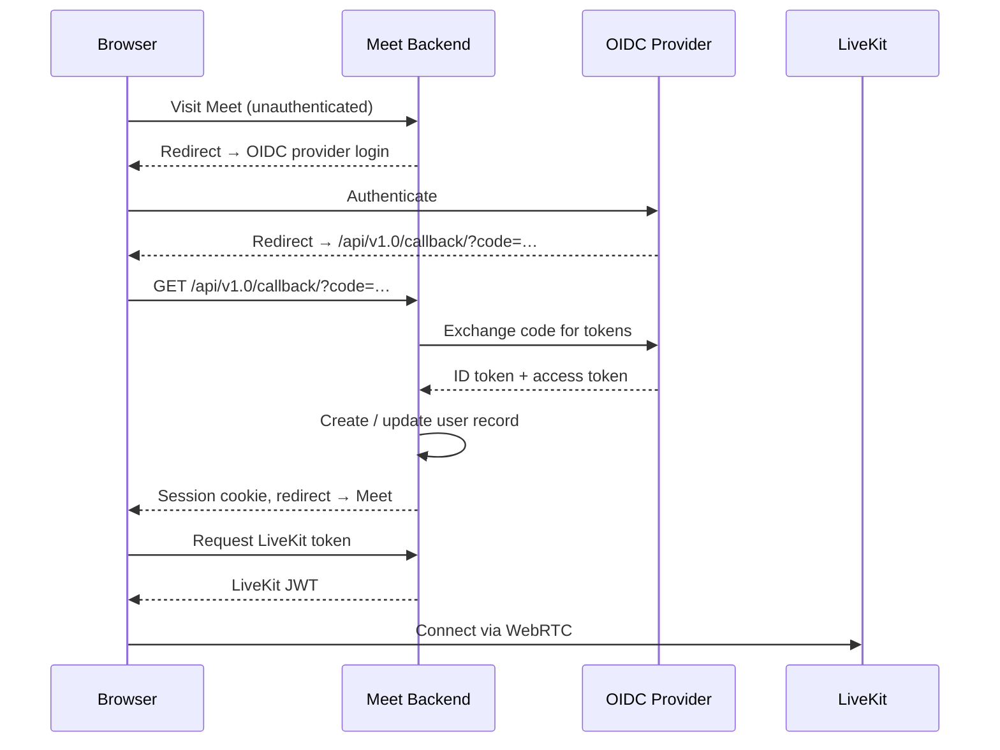

# SSO & Authentication

LaSuite Meet uses **OpenID Connect (OIDC)** for user authentication. You need an OIDC provider to run a production instance.

## Overview



Meet does not manage passwords. Authentication is fully delegated to an external OIDC provider. This means:

- You can use your existing identity provider
- No user passwords are stored in Meet's database
- Users have a single login for Meet and other apps in your ecosystem

## Supported providers

Any standards-compliant OIDC provider works. Tested and documented:

| Provider | Type | Notes |
|---|---|---|
| Keycloak | Self-hosted | Included in the dev stack |
| Authentik | Self-hosted | Recommended for new deployments |
| Dex | Self-hosted | Lightweight, connector-based |
| Auth0 | Cloud | Free tier available |
| Google Workspace | Cloud | For Google-based orgs |
| Microsoft Entra ID | Cloud | For Microsoft 365 orgs |
| ProConnect | Cloud | French government only |

## Setting up Keycloak (self-hosted)

The [Deployment Guide](../compose/deployment-guide.md) includes a complete, production-ready Keycloak setup (with TLS via your reverse proxy, a pre-imported realm, and correct redirect URIs). Follow that guide for the recommended setup.

The summary of what the deployment setup does for Keycloak:

### Client configuration

In your Keycloak realm (`meet`), the client must have:

- **Client ID**: `meet`
- **Client authentication**: enabled (confidential client)
- **Valid redirect URIs**: `https://meet.example.com/api/v1.0/callback/` . The trailing slash is required; the versioned path is not the standard `/oidc/callback/`
- **Web origins**: `https://meet.example.com`

### Meet environment variables

```dotenv
OIDC_RP_CLIENT_ID=meet
OIDC_RP_CLIENT_SECRET=<client-secret-from-keycloak>
OIDC_OP_JWKS_ENDPOINT=https://auth.example.com/realms/meet/protocol/openid-connect/certs
OIDC_OP_AUTHORIZATION_ENDPOINT=https://auth.example.com/realms/meet/protocol/openid-connect/auth
OIDC_OP_TOKEN_ENDPOINT=https://auth.example.com/realms/meet/protocol/openid-connect/token
OIDC_OP_USER_ENDPOINT=https://auth.example.com/realms/meet/protocol/openid-connect/userinfo
OIDC_OP_LOGOUT_ENDPOINT=https://auth.example.com/realms/meet/protocol/openid-connect/logout
```

> Keycloak must be served over HTTPS (`auth.example.com`, not `localhost:8080`). The backend resolves public hostnames via the `proxy` Docker network - ensure the backend service is in the `proxy` network in your compose file. See the [Deployment Guide](../compose/deployment-guide.md) for the full setup.

> If you need to make manual changes after deployment, the Keycloak admin console is at `https://auth.example.com` (not on a raw port; it is proxied by your reverse proxy).

## Setting up Authentik (self-hosted)

### 1. Create a provider in Authentik

1. Go to **Applications → Providers → Create**
2. Choose **OAuth2/OpenID Provider**
3. Set **Redirect URIs**: `https://meet.example.com/api/v1.0/callback/`
4. Note the **Client ID** and **Client Secret**

### 2. Get the OIDC endpoints

From Authentik's well-known endpoint:
```
https://authentik.example.com/application/o/<slug>/.well-known/openid-configuration
```

### 3. Configure Meet

```dotenv
OIDC_RP_CLIENT_ID=<client-id>
OIDC_RP_CLIENT_SECRET=<client-secret>
OIDC_OP_JWKS_ENDPOINT=https://authentik.example.com/application/o/<slug>/jwks/
OIDC_OP_AUTHORIZATION_ENDPOINT=https://authentik.example.com/application/o/authorize/
OIDC_OP_TOKEN_ENDPOINT=https://authentik.example.com/application/o/token/
OIDC_OP_USER_ENDPOINT=https://authentik.example.com/application/o/userinfo/
```

## Setting up Google Workspace

### 1. Create OAuth credentials

1. Go to [Google Cloud Console](https://console.cloud.google.com)
2. Create a project or select an existing one
3. Go to **APIs & Services → Credentials → Create Credentials → OAuth client ID**
4. Application type: **Web application**
5. Add authorized redirect URI: `https://meet.example.com/api/v1.0/callback/`
6. Note the **Client ID** and **Client Secret**

### 2. Configure Meet

```dotenv
OIDC_RP_CLIENT_ID=<client-id>.apps.googleusercontent.com
OIDC_RP_CLIENT_SECRET=<client-secret>
OIDC_OP_JWKS_ENDPOINT=https://www.googleapis.com/oauth2/v3/certs
OIDC_OP_AUTHORIZATION_ENDPOINT=https://accounts.google.com/o/oauth2/v2/auth
OIDC_OP_TOKEN_ENDPOINT=https://oauth2.googleapis.com/token
OIDC_OP_USER_ENDPOINT=https://openidconnect.googleapis.com/v1/userinfo
OIDC_RP_SIGN_ALGO=RS256
```

## Unauthenticated access

By default, unauthenticated users can create and join rooms (`ALLOW_UNREGISTERED_ROOMS=True`). To require authentication for all rooms:

```dotenv
ALLOW_UNREGISTERED_ROOMS=False
```

Unauthenticated users have limited permissions (no recording, no moderation).

## Customizing login redirect

To redirect unauthenticated users to a custom page instead of the OIDC login:

```dotenv
LOGIN_REDIRECT_URL=/
OIDC_REDIRECT_UNAUTHENTICATED_URL=https://your-portal.example.com/login
```

## Testing authentication

After configuration:

1. Open `https://meet.example.com`
2. You should be redirected to your OIDC provider's login page
3. After login, you should be redirected back to Meet
4. Check the Django admin at `https://meet.example.com/admin/` to see if your user was created

## Troubleshooting

**Redirect URI mismatch**: The redirect URI in your OIDC provider must exactly match `https://meet.example.com/api/v1.0/callback/` (trailing slash matters).

**Invalid client secret**: Double-check the `OIDC_RP_CLIENT_SECRET` value.

**Token validation fails**: Ensure `OIDC_OP_JWKS_ENDPOINT` is reachable from the Meet backend container.

**User not created in database**: Check `docker compose logs backend` for OIDC-related errors.
