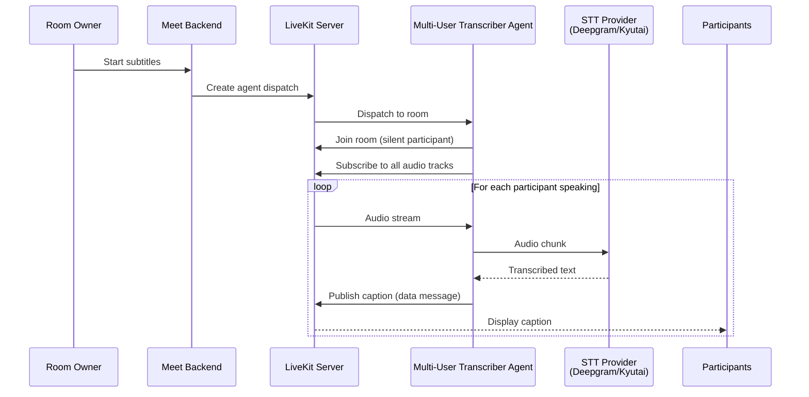

# Real-time Subtitles

Real-time subtitles provide live captions during meetings for accessibility. This feature uses a LiveKit agent with speech-to-text (STT) to generate captions as participants speak.

## How it works



The multi-user transcriber agent (`src/agents/multi_user_transcriber.py`) handles transcription for all participants simultaneously.

---

## Backend configuration

Enable subtitles in the Meet backend:

```bash
# env.d/development/common or env.d/production.dist/common
ROOM_SUBTITLE_ENABLED=True
ROOM_SUBTITLE_AGENT_NAME=multi-user-transcriber
```

| Variable | Required | Default | Description |
|----------|----------|---------|-------------|
| `ROOM_SUBTITLE_ENABLED` | Yes | `False` | Enable real-time subtitles feature |
| `ROOM_SUBTITLE_AGENT_NAME` | No | `multi-user-transcriber` | Name of the LiveKit agent to dispatch |

---

## Agent deployment

### Docker Compose

Add the multi-user transcriber agent to your `compose.yml`:

```yaml
multi-user-transcriber:
  image: lasuite/meet-agents:latest
  command: python multi_user_transcriber.py dev
  env_file:
    - env.d/development/multi_user_transcriber.dist
  depends_on:
    - livekit
  restart: unless-stopped
```

Create `env.d/development/multi_user_transcriber.dist`:

```bash
LIVEKIT_URL=ws://livekit:7880
LIVEKIT_API_KEY=your-api-key
LIVEKIT_API_SECRET=your-api-secret

# Choose STT provider: kyutai or deepgram
STT_PROVIDER=deepgram

# Deepgram configuration (if using Deepgram)
DEEPGRAM_API_KEY=your-deepgram-api-key
DEEPGRAM_STT_MODEL=nova-3
DEEPGRAM_STT_LANGUAGE=multi

# Kyutai configuration (if using Kyutai)
KYUTAI_STT_BASE_URL=http://kyutai-stt:8000
KYUTAI_API_KEY=your-kyutai-api-key

# Optional: Enable Voice Activity Detection
ENABLE_SILERO_VAD=true

# Optional: Sentry error tracking
SENTRY_DSN=
SENTRY_ENVIRONMENT=production
```

---

## STT Provider setup

### Option 1: Deepgram (Cloud)

1. Sign up at [deepgram.com](https://deepgram.com/)
2. Create an API key
3. Set `STT_PROVIDER=deepgram` and `DEEPGRAM_API_KEY` in the agent config

**Advantages:**
- No infrastructure required
- Supports many languages
- High accuracy

**Disadvantages:**
- Requires internet connectivity
- Per-minute usage costs
- Audio sent to third party

### Option 2: Kyutai Moshi (Self-hosted)

Deploy your own Kyutai instance for on-premise STT.

1. Set `STT_PROVIDER=kyutai`
2. Deploy a Kyutai STT service (implementation details depend on your Kyutai setup)
3. Configure `KYUTAI_STT_BASE_URL` and `KYUTAI_API_KEY`

**Advantages:**
- No third-party data sharing
- No per-use costs after deployment
- Full control

**Disadvantages:**
- Requires GPU for reasonable performance
- Self-hosted infrastructure maintenance

---

## Kubernetes deployment

Add the agent to your Helm values:

```yaml
agents:
  multiUserTranscriber:
    enabled: true
    replicas: 1
    
    env:
      STT_PROVIDER: "deepgram"
      DEEPGRAM_STT_MODEL: "nova-3"
      DEEPGRAM_STT_LANGUAGE: "multi"
      ENABLE_SILERO_VAD: "true"
    
    secrets:
      DEEPGRAM_API_KEY: "your-api-key"
```

The agent connects to the LiveKit server and waits for dispatch requests from the backend.

---

## Configuration reference

### Agent environment variables

| Variable | Required | Default | Description |
|----------|----------|---------|-------------|
| `LIVEKIT_URL` | Yes | - | LiveKit server WebSocket URL |
| `LIVEKIT_API_KEY` | Yes | - | LiveKit API key |
| `LIVEKIT_API_SECRET` | Yes | - | LiveKit API secret |
| `STT_PROVIDER` | Yes | `deepgram` | STT provider (`deepgram` or `kyutai`) |
| `TRANSCRIBER_AGENT_NAME` | No | `multi-user-transcriber` | Agent name for dispatch |
| `ENABLE_SILERO_VAD` | No | `true` | Enable Voice Activity Detection for better caption timing |

### Deepgram-specific variables

| Variable | Required | Default | Description |
|----------|----------|---------|-------------|
| `DEEPGRAM_API_KEY` | Yes (if using Deepgram) | - | Deepgram API key |
| `DEEPGRAM_STT_MODEL` | No | `nova-3` | Deepgram model to use |
| `DEEPGRAM_STT_LANGUAGE` | No | `multi` | Language code or `multi` for auto-detection |

### Kyutai-specific variables

| Variable | Required | Default | Description |
|----------|----------|---------|-------------|
| `KYUTAI_STT_BASE_URL` | Yes (if using Kyutai) | - | Kyutai service base URL |
| `KYUTAI_API_KEY` | Yes (if using Kyutai) | - | Kyutai API key |

---

## Testing

1. Enable subtitles in backend config and restart
2. Deploy the agent
3. Create a room as an owner
4. Start subtitles from the meeting controls
5. Speak - you should see captions appear within 1-2 seconds

Check agent logs for errors:

```bash
docker compose logs -f multi-user-transcriber
```

---

## Troubleshooting

**No captions appear**
- Check that `ROOM_SUBTITLE_ENABLED=True` in backend config
- Verify the agent is running: `docker compose ps multi-user-transcriber`
- Check agent logs for connection errors

**Captions are delayed or choppy**
- Network latency to STT provider (if using Deepgram)
- Insufficient agent resources
- Enable `ENABLE_SILERO_VAD=true` for better timing

**Agent fails to start**
- Missing required environment variables
- Invalid API keys
- Cannot connect to LiveKit server

---

## Resource requirements

- **CPU**: 0.5-1 core per active agent session
- **Memory**: 512MB-1GB per agent
- **Network**: Continuous audio streaming to STT provider (if cloud-based)

One agent instance can handle multiple rooms simultaneously through LiveKit's dispatch system.
