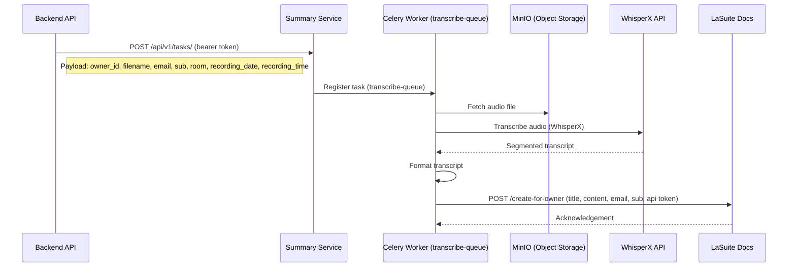

# AI Transcription

AI transcription is available in beta. When enabled, a recording session is automatically transcribed and the result is delivered to a LaSuite Docs instance, where the room owner can read and edit the transcript.

!!!info
    **Prerequisite:** Transcription requires the [Recording](recording.md) feature to be fully set up and working first. Transcription uses the same LiveKit Egress, MinIO, and webhook infrastructure.

**Known limitations:**

- Participant identification is not implemented. Speakers are labeled generically (e.g., `SPEAKER_00`, `SPEAKER_01`)
- Transcription relies on [WhisperX](https://github.com/m-bain/whisperX), which does not provide an OpenAI-compatible API

**Hard dependency**: LaSuite Docs
Transcription output is sent to a LaSuite Docs instance (`POST /create-for-owner`). Without a running LaSuite Docs service, transcription cannot deliver its results. This is a hard dependency of the current implementation.

## How it works



---

## Docker Compose setup

### Step 1: Configure the summary service

The summary service is the FastAPI application that handles transcription tasks. It is published on Docker Hub as `lasuite/meet-summary`.

Create its environment file `env.d/summary`:

```dotenv
# Redis (dedicated instance for the summary service)
REDIS_URL=redis://redis-summary:6379/0

# MinIO/S3 (to download audio recordings)
AWS_S3_ENDPOINT_URL=http://minio:9000
AWS_S3_ACCESS_KEY_ID=minioadmin
AWS_S3_SECRET_ACCESS_KEY=minioadmin123
AWS_STORAGE_BUCKET_NAME=meet-media-storage
AWS_S3_SECURE_ACCESS=False

# Authorized tenants - authenticates the Meet backend and delivers results back to it.
# Replace the api_key values with strong random secrets (openssl rand -hex 32).
AUTHORIZED_TENANTS='[{"id":"meet","api_key":"<generate-a-strong-secret>","webhook_url":"https://meet.example.com/api/v1/tasks/callback/","webhook_api_key":"<generate-a-strong-secret>"}]'

# WhisperX STT API
WHISPERX_BASE_URL=https://your-whisperx-instance.example.com
WHISPERX_ASR_MODEL=large-v3
WHISPERX_API_KEY=your-api-key
```

!!!info
    `AUTHORIZED_TENANTS` is a JSON array. Each entry defines one Meet backend that is allowed to submit transcription tasks and receive results. The `api_key` authenticates inbound requests from the Meet backend; the `webhook_api_key` authenticates outbound callbacks to Meet. Use separate strong secrets for each.

    The legacy single-variable approach (`WEBHOOK_URL` / `WEBHOOK_API_TOKEN` / `APP_API_TOKEN`) still works but is deprecated and logs a warning at startup. Migrate to `AUTHORIZED_TENANTS` for new deployments.

You need a running [WhisperX](https://github.com/suitenumerique/meet-whisperx) instance. An Open Source implementation combining WhisperX and FastAPI is available at [github.com/suitenumerique/meet-whisperx](https://github.com/suitenumerique/meet-whisperx).

### Step 2: Add to compose.yml

```yaml
redis-summary:
  image: redis:7
  restart: unless-stopped
  networks:
    - internal

app-summary:
  image: lasuite/meet-summary:latest
  restart: unless-stopped
  env_file:
    - env.d/summary
  depends_on:
    - redis-summary
  networks:
    - internal

celery-summary-transcribe:
  image: lasuite/meet-summary:latest
  restart: unless-stopped
  command: celery -A summary.core.celery_worker worker --pool=solo -Q transcribe-queue
  env_file:
    - env.d/summary
  depends_on:
    - redis-summary
    - minio
  networks:
    - internal
```

### Step 3: Connect the Meet backend to the summary service

Add to your `.env`:

```dotenv
SUMMARY_SERVICE_ENDPOINT=http://app-summary:8000/api/v1/tasks/
SUMMARY_SERVICE_API_TOKEN=<same-api_key-you-set-in-AUTHORIZED_TENANTS>
```

The `SUMMARY_SERVICE_API_TOKEN` must match the `api_key` value you set in `AUTHORIZED_TENANTS` for the Meet backend tenant.

Restart the backend:

```bash
docker compose up -d --force-recreate backend
```

### Step 4: Configure the WhisperX STT backend

The summary service connects to a WhisperX API for speech-to-text. Point it to your WhisperX instance in `env.d/summary`:

```dotenv
WHISPERX_BASE_URL=https://your-whisperx-instance.example.com
WHISPERX_ASR_MODEL=large-v3
WHISPERX_API_KEY=your-api-key
```

For production, a GPU-enabled WhisperX instance is strongly recommended. Transcription on CPU is very slow for anything beyond short recordings.

---

## Kubernetes setup

Transcription in Kubernetes uses the summary service and Celery workers included in the Meet Helm chart. The recording infrastructure (MinIO, Egress, `ingressMedia`) must be set up first. See [Recording: Kubernetes setup](recording.md#kubernetes-setup).

### Step 1: Enable the summary service

Add to your `values.yaml`:

```yaml
summary:
  replicas: 1
  envVars:
    REDIS_URL: "redis://redis-master:6379/1"
    AWS_S3_ENDPOINT_URL: "http://minio:9000"
    AWS_S3_ACCESS_KEY_ID: "minioadmin"
    AWS_S3_SECRET_ACCESS_KEY: "minioadmin123"
    AWS_STORAGE_BUCKET_NAME: "meet-media-storage"
    AWS_S3_SECURE_ACCESS: "False"
    AUTHORIZED_TENANTS: '[{"id":"meet","api_key":"<generate-a-strong-secret>","webhook_url":"https://meet.example.com/api/v1/tasks/callback/","webhook_api_key":"<generate-a-strong-secret>"}]'
    WHISPERX_BASE_URL: "https://your-whisperx-instance.example.com"
    WHISPERX_ASR_MODEL: "large-v3"
    WHISPERX_API_KEY: "your-api-key"
```

You need a running [WhisperX](https://github.com/suitenumerique/meet-whisperx) instance reachable from within the cluster. For production, a GPU-enabled instance is strongly recommended.

### Step 2: Enable the Celery transcribe worker

```yaml
celeryTranscribe:
  instances:
    - name: transcribe-1
      replicas: 1

celeryBackend:
  replicas: 1
```

### Step 3: Connect the Meet backend to the summary service

Add to `backend.envVars` in your `values.yaml`:

```yaml
backend:
  envVars:
    SUMMARY_SERVICE_ENDPOINT: "http://meet-summary:8000/api/v1/tasks/"
    SUMMARY_SERVICE_API_TOKEN: "<same-api_key-you-set-in-AUTHORIZED_TENANTS>"
```

Apply the updated chart:

```bash
helm upgrade meet meet/meet --namespace meet --values values.yaml
```


## Full configuration reference

| Option | Type | Default | Description |
|---|---|---|---|
| `authorized_tenants` | JSON array | `[]` | **Current approach.** Array of tenant configs, each with `id`, `api_key`, `webhook_url`, and `webhook_api_key`. |
| `app_name` | String | `"summary"` | Internal service name used for API routing. Must be `"summary"` - using any other value causes routing errors. |
| `celery_broker_url` | String | `"redis://redis/0"` | Celery broker URL |
| `celery_result_backend` | String | `"redis://redis/0"` | Celery result backend URL |
| `celery_max_retries` | Integer | `1` | Maximum retries for Celery tasks |
| `transcribe_queue` | String | `"transcribe-queue"` | Name of the Celery queue for transcription tasks |
| `aws_storage_bucket_name` | String | - | S3/MinIO bucket name |
| `aws_s3_endpoint_url` | String | - | S3/MinIO endpoint URL |
| `aws_s3_access_key_id` | String | - | S3/MinIO access key |
| `aws_s3_secret_access_key` | Secret | - | S3/MinIO secret key |
| `aws_s3_secure_access` | Boolean | `True` | Use HTTPS for S3/MinIO requests |
| `whisperx_api_key` | Secret | - | API key for WhisperX |
| `whisperx_base_url` | String | `"https://api.openai.com/v1"` | Base URL for the WhisperX-compatible API. The default targets the OpenAI Whisper API. Override with your self-hosted WhisperX URL (e.g., `http://whisperx:8000/v1`). |
| `whisperx_asr_model` | String | `"whisper-1"` | ASR model for transcription. Use `"whisper-1"` for the OpenAI API, or a WhisperX model like `"large-v3"` for a self-hosted instance. |
| `whisperx_default_language` | String | - | ISO 639-1 language code (e.g., `"fr"`, `"en"`). When set, skips automatic language detection. |
| `whisperx_allowed_languages` | Set | `{"en","fr","de","nl"}` | Set of accepted language codes. Requests for other languages are rejected. |
| `whisperx_max_retries` | Integer | `0` | Maximum retries for WhisperX requests |
| `webhook_max_retries` | Integer | `2` | Maximum retries for webhook requests |
| `webhook_status_forcelist` | List\[Int\] | `[502, 503, 504]` | HTTP status codes that trigger webhook retry |
| `webhook_backoff_factor` | Float | `0.1` | Exponential backoff factor for webhook retries |
| `recording_max_duration` | Integer | `None` | Max audio duration in milliseconds; longer recordings are ignored |
| `document_default_title` | String | `"Transcription"` | Default title for generated documents |
| `document_title_template` | String | `'Réunion "{room}" du {room_recording_date} à {room_recording_time}'` | Template for document title |
| `is_summary_enabled` | Boolean | `True` | Enable AI summarization in addition to transcription. Set to `False` to produce transcripts only. |
| `sentry_is_enabled` | Boolean | `False` | Enable Sentry error tracking |
| `sentry_dsn` | String | `None` | Sentry DSN |


## Supported audio formats

The summary service accepts: `.mp4`, `.webm`, `.wav`, `.mp3`, `.ogg`.


## LLM summarization (optional, separate feature)

Summarization (generating a written summary from the transcript using an LLM) is a separate optional feature, not part of basic transcription. It requires an additional Celery worker and LLM API access. Refer to the upstream [summarization documentation](https://github.com/suitenumerique/meet/blob/main/docs/features/summarization.md) for setup details.