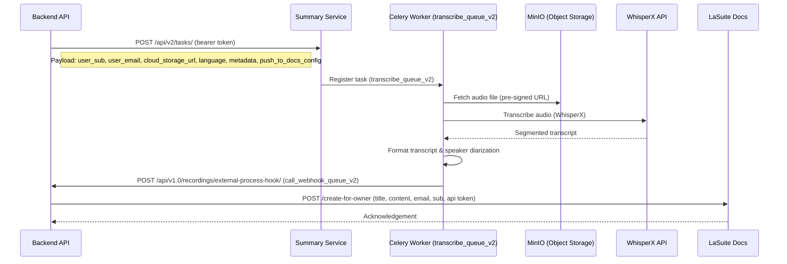

# AI Transcription

AI transcription is available in beta. When enabled, a recording session is automatically transcribed and the result is delivered to a LaSuite Docs instance, where the room owner can read and edit the transcript.

!!!info
    **Prerequisite:** Transcription requires the [Recording](recording.md) feature to be fully set up and working first. Transcription uses the same LiveKit Egress, MinIO, and LiveKit webhook infrastructure.

**Speaker identification:**

Speaker-to-participant assignment is implemented. The system:
1. Uses WhisperX for speaker diarization (generates `SPEAKER_00`, `SPEAKER_01`, etc.)
2. Matches diarized speakers to participant names by correlating with Voice Activity Detection (VAD) metadata from the metadata collector agent
3. Replaces generic speaker labels with actual participant names in the transcript

**Requirements for speaker identification:**
- The metadata collector agent must be running and collecting VAD events during the recording
- Without VAD metadata, speakers remain labeled as `SPEAKER_00`, `SPEAKER_01`, etc.

See `src/summary/summary/core/user_assign.py` for the speaker assignment implementation.

**Technical requirements:**

- Transcription requires [WhisperX](https://github.com/m-bain/whisperX), which provides a custom API (not OpenAI-compatible). A Docker image is available at [github.com/suitenumerique/meet-whisperx](https://github.com/suitenumerique/meet-whisperx).

**Hard dependency**: LaSuite Docs
Transcription output is sent to a LaSuite Docs instance (`POST /create-for-owner`). Without a running LaSuite Docs service, transcription cannot deliver its results. This is a hard dependency of the current implementation.

## How it works


```mermaid
sequenceDiagram
  participant Backend as Backend API
  participant Summary as Summary Service
  participant Celery as Celery Worker (transcribe_queue_v2)
  participant MinIO as MinIO (Object Storage)
  participant STT as WhisperX API
  participant Docs as LaSuite Docs

  Backend->>Summary: POST /api/v2/tasks/ (bearer token)
  Note right of Backend: Payload: user_sub, user_email, cloud_storage_url, language, metadata, push_to_docs_config

  Summary->>Celery: Register task (transcribe_queue_v2)
  Celery->>MinIO: Fetch audio file (pre-signed URL)
  Celery->>STT: Transcribe audio (WhisperX)
  STT-->>Celery: Segmented transcript
  Celery->>Celery: Format transcript & speaker diarization
  Celery->>Backend: POST /api/v1.0/recordings/external-process-hook/ (call_webhook_queue_v2)
  Backend->>Docs: POST /create-for-owner (title, content, email, sub, api token)
  Docs-->>Backend: Acknowledgement
```

---

## Docker Compose setup

### Step 1: Configure the summary service

The summary service is the FastAPI application that handles transcription tasks. It is published on Docker Hub as `lasuite/meet-summary`.

Create its environment file `env.d/summary`:

```dotenv
# Celery broker (dedicated Redis instance for the summary service)
CELERY_BROKER_URL=redis://redis-summary:6379/0
CELERY_RESULT_BACKEND=redis://redis-summary:6379/0

# MinIO/S3 (to download audio recordings)
AWS_S3_ENDPOINT_URL=http://minio:9000
AWS_S3_ACCESS_KEY_ID=minioadmin
AWS_S3_SECRET_ACCESS_KEY=minioadmin123
AWS_STORAGE_BUCKET_NAME=meet-media-storage
AWS_S3_SECURE_ACCESS=False

# Authorized tenants - authenticates the Meet backend and delivers results back to it.
# Replace the api_key values with strong random secrets (openssl rand -hex 32).
AUTHORIZED_TENANTS='[{"id":"meet","api_key":"<generate-a-strong-secret>","webhook_url":"https://meet.example.com/api/v1.0/recordings/external-process-hook/","webhook_api_key":"<generate-a-strong-secret>"}]'

# WhisperX STT API
WHISPERX_BASE_URL=https://your-whisperx-instance.example.com
WHISPERX_ASR_MODEL=large-v3
WHISPERX_API_KEY=your-api-key

# LLM for summarization (required even if IS_SUMMARY_ENABLED=False)
LLM_BASE_URL=https://your-llm-api.example.com/v1
LLM_API_KEY=your-llm-api-key
LLM_MODEL=gpt-4o-mini
```

!!!info
    `AUTHORIZED_TENANTS` is a JSON array. Each entry defines one Meet backend that is allowed to submit transcription tasks and receive results. The `api_key` authenticates inbound requests from the Meet backend; the `webhook_api_key` authenticates outbound callbacks to Meet. Use separate strong secrets for each.

    The legacy single-variable approach (`WEBHOOK_URL` / `WEBHOOK_API_TOKEN` / `APP_API_TOKEN`) still works but is deprecated and logs a warning at startup. Migrate to `AUTHORIZED_TENANTS` for new deployments.

You need a running [WhisperX](https://github.com/suitenumerique/meet-whisperx) instance. An Open Source implementation combining WhisperX and FastAPI is available at [github.com/suitenumerique/meet-whisperx](https://github.com/suitenumerique/meet-whisperx).

### Step 2: Add to compose.yml

```yaml
redis-summary:
  image: redis:7
  restart: unless-stopped
  networks:
    - internal

app-summary:
  image: lasuite/meet-summary:latest
  restart: unless-stopped
  env_file:
    - env.d/summary
  depends_on:
    - redis-summary
  networks:
    - internal

celery-summary-transcribe:
  image: lasuite/meet-summary:latest
  restart: unless-stopped
  command: celery -A summary.core.celery_worker worker --pool=solo -Q transcribe_queue_v2
  env_file:
    - env.d/summary
  depends_on:
    - redis-summary
    - minio
  networks:
    - internal

celery-summary-webhook:
  image: lasuite/meet-summary:latest
  restart: unless-stopped
  command: celery -A summary.core.celery_worker worker --pool=solo -Q call_webhook_queue_v2
  env_file:
    - env.d/summary
  depends_on:
    - redis-summary
  networks:
    - internal
```

### Step 3: Connect the Meet backend to the summary service

Add to your `env.d/development/common` or `.env`:

```dotenv
SUMMARY_SERVICE_VERSION=2
SUMMARY_SERVICE_ENDPOINT=http://app-summary:8000/api/v2/async-jobs/transcribe/
SUMMARY_SERVICE_API_TOKEN=<same-api_key-you-set-in-AUTHORIZED_TENANTS>
SUMMARY_SERVICE_WEBHOOK_API_TOKEN=<same-webhook_api_key-you-set-in-AUTHORIZED_TENANTS>
```

- `SUMMARY_SERVICE_VERSION=2` is **required**. The default is `1` (deprecated). The backend logs a warning if this is not set to `2`.
- `SUMMARY_SERVICE_ENDPOINT` points to the v2 transcribe endpoint: `/api/v2/async-jobs/transcribe/`
- `SUMMARY_SERVICE_API_TOKEN` must match the `api_key` you set in the summary service's `AUTHORIZED_TENANTS`.
- `SUMMARY_SERVICE_WEBHOOK_API_TOKEN` must match the `webhook_api_key` you set in the summary service's `AUTHORIZED_TENANTS`.

Restart the backend:

```bash
docker compose up -d --force-recreate backend
```

### Step 4: Configure the WhisperX STT backend

The summary service connects to a WhisperX API for speech-to-text. Point it to your WhisperX instance in `env.d/summary`:

```dotenv
WHISPERX_BASE_URL=https://your-whisperx-instance.example.com
WHISPERX_ASR_MODEL=large-v3
WHISPERX_API_KEY=your-api-key
```

For production, a GPU-enabled WhisperX instance is strongly recommended. Transcription on CPU is very slow for anything beyond short recordings.

---

## Kubernetes setup

Transcription in Kubernetes uses the summary service and Celery workers included in the Meet Helm chart. The recording infrastructure (MinIO, Egress, `ingressMedia`) must be set up first. See [Recording: Kubernetes setup](recording.md#kubernetes-setup).

### Step 1: Enable the summary service

Add to your `values.yaml`:

```yaml
summary:
  replicas: 1
  envVars:
    CELERY_BROKER_URL: "redis://redis-master:6379/1"
    CELERY_RESULT_BACKEND: "redis://redis-master:6379/1"
    AWS_S3_ENDPOINT_URL: "http://minio:9000"
    AWS_S3_ACCESS_KEY_ID: "minioadmin"
    AWS_S3_SECRET_ACCESS_KEY: "minioadmin123"
    AWS_STORAGE_BUCKET_NAME: "meet-media-storage"
    AWS_S3_SECURE_ACCESS: "False"
    AUTHORIZED_TENANTS: '[{"id":"meet","api_key":"<generate-a-strong-secret>","webhook_url":"https://meet.example.com/api/v1.0/recordings/external-process-hook/","webhook_api_key":"<generate-a-strong-secret>"}]'
    WHISPERX_BASE_URL: "https://your-whisperx-instance.example.com"
    WHISPERX_ASR_MODEL: "large-v3"
    WHISPERX_API_KEY: "your-api-key"
    LLM_BASE_URL: "https://your-llm-api.example.com/v1"
    LLM_API_KEY: "your-llm-api-key"
    LLM_MODEL: "gpt-4o-mini"
```

You need a running [WhisperX](https://github.com/suitenumerique/meet-whisperx) instance reachable from within the cluster. For production, a GPU-enabled instance is strongly recommended.

### Step 2: Enable the Celery transcribe worker

```yaml
celeryTranscribe:
  instances:
    - name: transcribe-1
      replicas: 1

celeryBackend:
  replicas: 1
```

### Step 3: Connect the Meet backend to the summary service

Add to `backend.envVars` in your `values.yaml`:

```yaml
backend:
  envVars:
    SUMMARY_SERVICE_VERSION: "2"
    SUMMARY_SERVICE_ENDPOINT: "http://meet-summary:80/api/v2/async-jobs/transcribe/"
    SUMMARY_SERVICE_API_TOKEN: "<same-api_key-you-set-in-AUTHORIZED_TENANTS>"
    SUMMARY_SERVICE_WEBHOOK_API_TOKEN: "<same-webhook_api_key-you-set-in-AUTHORIZED_TENANTS>"
```

Apply the updated chart:

```bash
helm upgrade meet meet/meet --namespace meet --values values.yaml
```


## Full configuration reference

See [Environment Variables](../../reference/env-variables.md) for the complete, verified reference covering every setting below plus observability (Sentry/PostHog/Langfuse) and the LaSuite Docs integration. The table below only covers what's specific to transcription.

| Variable | Type | Default | Description |
|---|---|---|---|
| `AUTHORIZED_TENANTS` | JSON array | -- (required) | Array of tenant configs, each with `id`, `api_key`, `webhook_url`, and `webhook_api_key`. |
| `CELERY_BROKER_URL` | String | `"redis://redis/0"` | Celery broker URL |
| `CELERY_RESULT_BACKEND` | String | `"redis://redis/0"` | Celery result backend URL |
| `CELERY_MAX_RETRIES` | Integer | `1` | Maximum retries for a failed Celery task |
| `TRANSCRIBE_QUEUE_V2` | String | `"transcribe-queue-v2"` | Name of the Celery queue for transcription tasks (v2) |
| `CALL_WEBHOOK_QUEUE_V2` | String | `"call-webhook-queue-v2"` | Name of the Celery queue for webhook callbacks (v2) |
| `SUMMARIZE_QUEUE_V2` | String | `"summarize-queue-v2"` | Name of the Celery queue for summarization tasks (v2, optional) |
| `AWS_STORAGE_BUCKET_NAME` | String | -- (required) | S3/MinIO bucket name |
| `AWS_S3_ENDPOINT_URL` | String | -- (required) | S3/MinIO endpoint URL |
| `AWS_S3_ACCESS_KEY_ID` | String | -- (required) | S3/MinIO access key |
| `AWS_S3_SECRET_ACCESS_KEY` | Secret | -- (required) | S3/MinIO secret key |
| `AWS_S3_SECURE_ACCESS` | Boolean | `True` | Use HTTPS for S3/MinIO requests |
| `AWS_S3_REGION_NAME` | String | -- | S3 region |
| `AWS_TRANSCRIPT_PATH` | String | `"transcripts"` | Folder/prefix used in object storage for transcript files |
| `WHISPERX_API_KEY` | Secret | -- (required) | API key for WhisperX |
| `WHISPERX_BASE_URL` | String | `"https://api.openai.com/v1"` | Base URL for the WhisperX-compatible API. The default targets the OpenAI Whisper API. Override with your self-hosted WhisperX URL (e.g., `http://whisperx:8000/v1`). |
| `WHISPERX_ASR_MODEL` | String | `"whisper-1"` | ASR model for transcription. Use `"whisper-1"` for the OpenAI API, or a WhisperX model like `"large-v3"` for a self-hosted instance. |
| `WHISPERX_DEFAULT_LANGUAGE` | String | -- | ISO 639-1 language code (e.g., `"fr"`, `"en"`). When set, skips automatic language detection. |
| `WHISPERX_ALLOWED_LANGUAGES` | Set | `{"en","fr","de","nl"}` | Set of accepted language codes. Requests for other languages are rejected. |
| `HALLUCINATION_PATTERNS` | List\[String\] | `["Vap'n'Roll Thierry"]` | Transcript substrings treated as known WhisperX hallucinations and filtered out |
| `IS_RESOLVE_SPEAKER_IDENTITIES_ENABLED` | Boolean | `True` | Match diarized `SPEAKER_00`-style labels to real participant names using VAD metadata |
| `WEBHOOK_MAX_RETRIES` | Integer | `2` | Maximum retries for a failed webhook delivery |
| `WEBHOOK_STATUS_FORCELIST` | List\[Int\] | `[502, 503, 504]` | HTTP status codes that trigger a retry |
| `WEBHOOK_BACKOFF_FACTOR` | Float | `0.1` | Exponential backoff factor between webhook retries |
| `RECORDING_MAX_DURATION` | Integer | `None` | Max audio duration in milliseconds; longer recordings are ignored |
| `IS_SUMMARY_ENABLED` | Boolean | `True` | Enable AI summarization in addition to transcription. Set to `False` to produce transcripts only. |


## Supported audio formats

The summary service accepts: `.mp4`, `.webm`, `.wav`, `.mp3`, `.ogg`.


## LLM summarization (optional, separate feature)

Summarization (generating a written summary from the transcript using an LLM) is a separate optional feature, not part of basic transcription. It runs on the same `summarize_queue_v2` Celery worker. Set `LLM_BASE_URL`, `LLM_API_KEY`, and `LLM_MODEL` - see the [LLM (summarization)](../../reference/env-variables.md#llm-summarization) section of the Environment Variables reference. Set `IS_SUMMARY_ENABLED=False` to produce transcripts only.