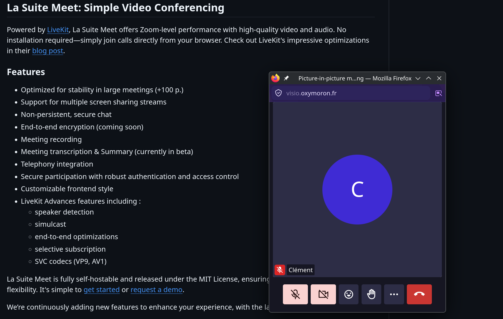
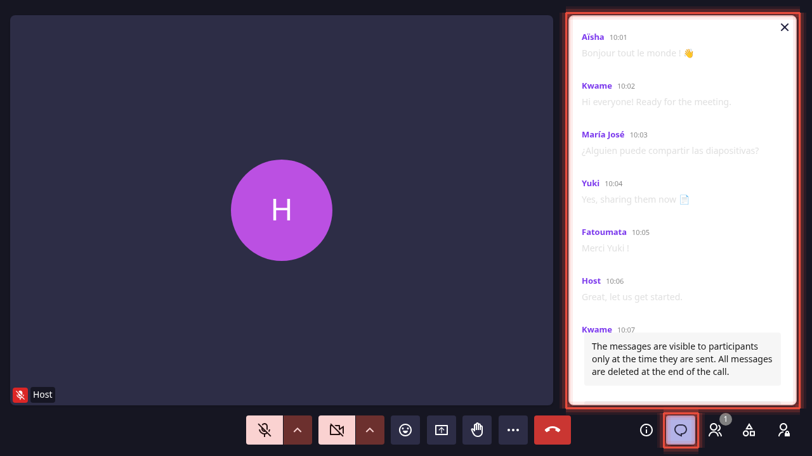
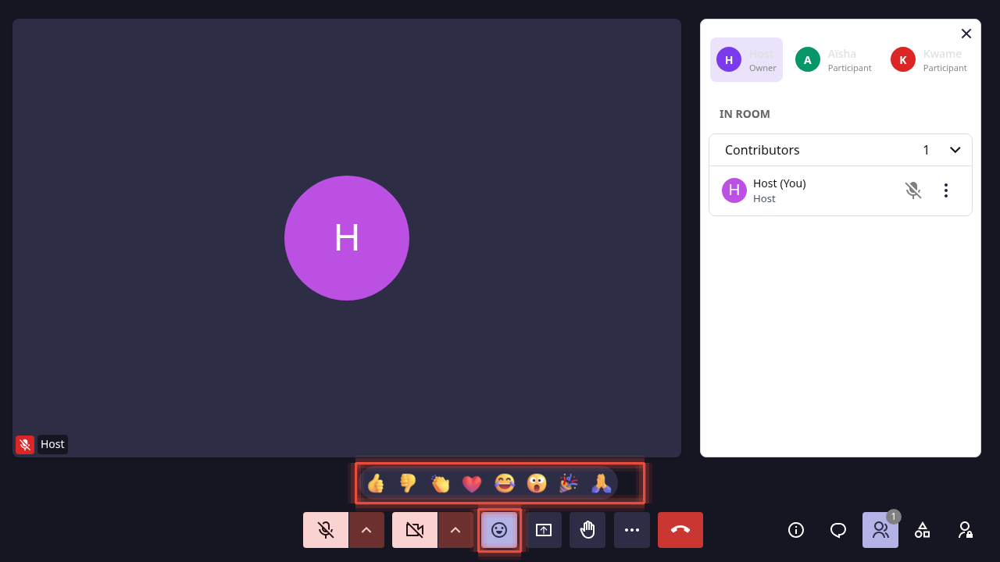
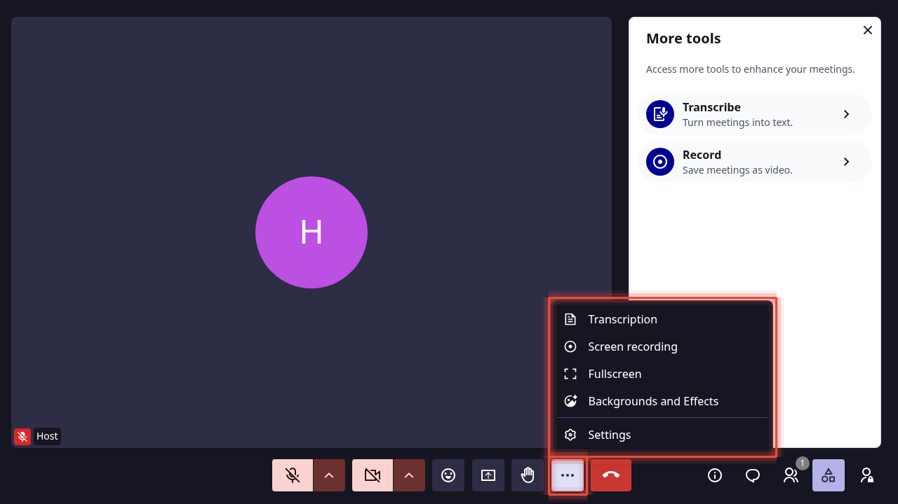
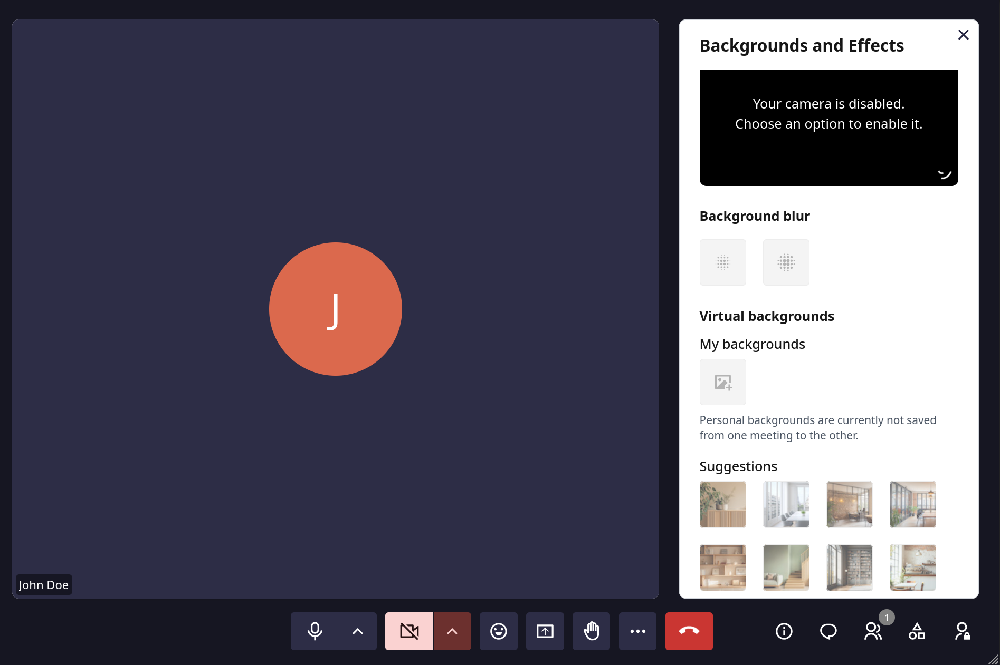

# Features & Controls

Complete reference for everything available once you are inside a LaSuite Meet meeting: controls, features, permissions, and roles.

> For joining a meeting and pre-join screen setup, see [Getting Started](getting-started.md).

## Video layout

The center of the screen shows all active participants as video tiles. The active speaker is automatically highlighted. You can pin any participant to the main view by hovering over their tile and clicking the **Pin** icon.

## Picture-in-picture

Click **...** (More options) → **Picture-in-picture** to detach the active speaker's video into a floating mini-window managed by your browser. The mini-window stays visible while you switch to other tabs or applications.

To exit picture-in-picture, click the **×** on the mini-window or return to the Meet tab and click **Picture-in-picture** again.

## Control bar

The control bar at the bottom provides all meeting actions.

| Icon | Control | Action |
|---|---|---|
|  | Microphone | Mute or unmute your microphone |
|  | ↑ (next to microphone) | Select audio input device |
|  | Camera | Enable or disable your video feed |
|  | ↑ (next to camera) | Select camera device or open **Background and effects** |
|  | Reactions | Open the emoji reaction toolbar |
|  | Screen share | Start or stop sharing your screen |
|  | Subtitles | Toggle live captions |
|  | Raise hand | Signal you want to speak |
|  | ... (More options) | Picture in picture, transcription, screen recording, fullscreen, backgrounds and effects, settings |
|  | Leave | Exit the meeting |
|  | Chat | Open the chat panel |
|  | Participants | Open the participants panel |
|  | More tools | Transcribe, record, share files |
|  | Open admin | Room details, access rights, participants |

## Screen sharing

Meet supports multiple simultaneous screen sharing streams. Any participant can share their screen at any time.

### Starting a screen share

1. Click the **Screen share** button
2. Your browser opens a dialog to choose what to share:
   - **Entire screen** - shares your full desktop
   - **Window** - shares a single application window
   - **Browser tab** - shares a specific tab (also shares the tab's audio)
3. Select what you want to share and click **Share**

### Sharing audio alongside your screen

When sharing a **browser tab**, check **Share tab audio** in the browser dialog. Useful for videos, presentations with sound, or audio demos.

> Audio sharing from windows or the entire screen is browser-dependent. Chrome on Windows supports system audio sharing; Firefox and Safari do not.

### Stopping screen share

- Click the **Stop sharing** button that appears in your browser's notification bar, or
- Click the **Screen share** button again in the control bar

### Screen share and recording

All active screen shares are captured in recordings. The recording shows the same layout that participants see.

### Tips

- Close sensitive tabs or windows before sharing your entire screen
- Use tab sharing when presenting from a browser: it isolates exactly what you want to show
- Hide notifications before sharing to avoid interruptions

## Chat

### Opening the chat

Click the **Chat** icon in the control bar. A badge shows unread message count when the panel is closed.

### Sending a message

Type your message and press **Enter** or click the send button.

### Chat characteristics

- **Non-persistent**: Messages are not saved. When the last participant leaves, all chat history is cleared.
- **Room-scoped**: Messages are visible to all current participants. There are no private messages.
- New chat messages are announced to screen readers via ARIA live regions.

## Reactions & Hand raise

### Sending a reaction

Click the **Reactions** button or press `Ctrl+Shift+E`. Click any emoji in the toolbar. It appears as an animated overlay on your tile, visible to all participants for a few seconds.

### Raise hand

The **Raise hand** button (✋) stays visible until you lower it. It:

- Adds a visual indicator to your tile
- Places you in a queue visible to the host, in the order hands were raised

To lower your hand, click the button again.

### Keyboard access

Press `Ctrl+Shift+E` to focus the reactions toolbar. Use arrow keys to navigate and Enter to send. Press `Escape` to close.

### Reaction settings

In **Settings → Accessibility** you can toggle whether reactions are announced to screen readers and enable or disable reaction sounds.

## File sharing

Click **More tools** → **Share a file** and select a file. It becomes available for all participants to download from the side panel.

> File sharing availability depends on your instance configuration. Contact your administrator if the option is not visible.

## Backgrounds & Effects

You can configure a virtual background:
- From the **pre-join screen**: click **Backgrounds and effects** before entering
- During a meeting: click the **↑** arrow next to the camera button, or click **...** (More options) → **Background and effects**

- **Blur** - blur your real background while keeping your face visible
- **Custom image** - set any image as your background

If your instance allows it, you can upload your own background images (max 10, max 2 MB each, JPEG/PNG only).

> Custom background image uploads are disabled by default. Administrators enable them by setting `FILE_UPLOAD_ENABLED=True` in the backend configuration. Background effects require camera access to function.

## Telephony (dial-in)

If telephony is configured on your instance, participants can join a meeting by phone without needing a browser or internet connection.

**Finding the dial-in number and PIN:** Click the room info button (left sidebar, ℹ️ icon) to see the phone number and PIN code assigned to the room.

**To join by phone:**
1. Dial the phone number shown in the room info panel
2. Enter the PIN when prompted
3. You are connected as an audio-only participant

**What to expect as a phone participant:**
- Audio only (no video, screen sharing, reactions, or chat)
- You cannot join before the first browser-based (WebRTC) participant has connected
- Your participation is visible to other participants in the participants panel

> Telephony must be enabled and configured by your administrator. If you do not see a phone number in the room info panel, the feature is not active on your instance.

## Roles & Permissions

### Roles

Every participant has one of three roles:

| Role | Description |
|---|---|
| **Owner** | Created the room. Has full control. |
| **Administrator** | Granted elevated privileges by the owner. |
| **Member** | Standard participant. |

### How roles are assigned

**Owner** is set automatically when a room is created - the user who clicks **Start an instant meeting** or **Create a meeting for later** becomes the owner.

**Administrator** and **Member** roles must be explicitly granted. There is no in-meeting interface for this: role management is done outside the meeting via the API or the admin panel. See [Room Access & Roles](../reference/api.md#room-access-roles) in the API reference.

**Email invitations** (via **...** → **Invite**) send a join link only - they do not grant a persistent role. A recipient who joins a public or trusted room through that link participates in the meeting but has no role record in the room's access list.

### Permissions by role

| Action | Owner | Administrator | Member |
|---|---|---|---|
| Start/stop recording | ✅ | ✅ | ❌ |
| Start/stop transcription | ✅ | ✅ | ❌ |
| Mute other participants | ✅ | ✅ | ✅ * |
| Remove participants | ✅ | ✅ | ❌ |
| Admit waiting participants | ✅ | ✅ | ❌ |
| Share screen | ✅ | ✅ | ✅ |
| Send chat messages | ✅ | ✅ | ✅ |
| Send reactions | ✅ | ✅ | ✅ |
| Raise hand | ✅ | ✅ | ✅ |
| Share files | ✅ | ✅ | ✅ (if enabled) |
| Update room settings | ✅ | ✅ | ❌ |
| Delete room | ✅ | ❌ | ❌ |

\* Members can mute by default. Owners and administrators can disable this by setting **everyone can mute** to off in room settings.

### Room access levels

Each room has one of three access settings, configurable by the owner or administrator from the room info panel:

| Access level | Effect |
|---|---|
| **Open** | Anyone with the link can join immediately |
| **Open to trusted people** | Authenticated users join directly; others must request entry |
| **Restricted** | All participants must request entry |

When access is **Restricted**, waiting participants appear in the **Participants panel → Lobby** section. A pop-up also appears for the host when someone is waiting.

### Muting participants

Open the **Participants** panel, hover over a name, and click **Mute**.

> You cannot force someone's camera off. Only their microphone can be muted.

### Removing participants

Open the **Participants** panel, hover over the participant's name, and click **Remove**. They see a message and cannot rejoin without a new invite.

### Push-to-talk

Hold `V` to temporarily unmute while muted. Release `V` to mute again. Useful in formal meetings where participants are muted by default.

### Leaving the meeting

Click **Leave** to exit. The meeting continues for other participants. There is no "end for all" action. The room closes automatically when the last participant leaves. The room itself (name and settings) is not deleted and can be reused.

## Recording

Only room owners and administrators can start a recording. Click **...** (More options) → **Screen recording** to begin. All participants see a red recording indicator. Click **...** → **Screen recording** again to stop.

For full details on downloading recordings and what gets captured, see [Recording](recording.md).

## AI Transcription

Room owners and administrators can start live transcription via **...** (More options) → **Transcription**. Select the meeting language before starting. Optionally enable recording at the same time.

For full details, see [AI Transcription](transcription.md).
