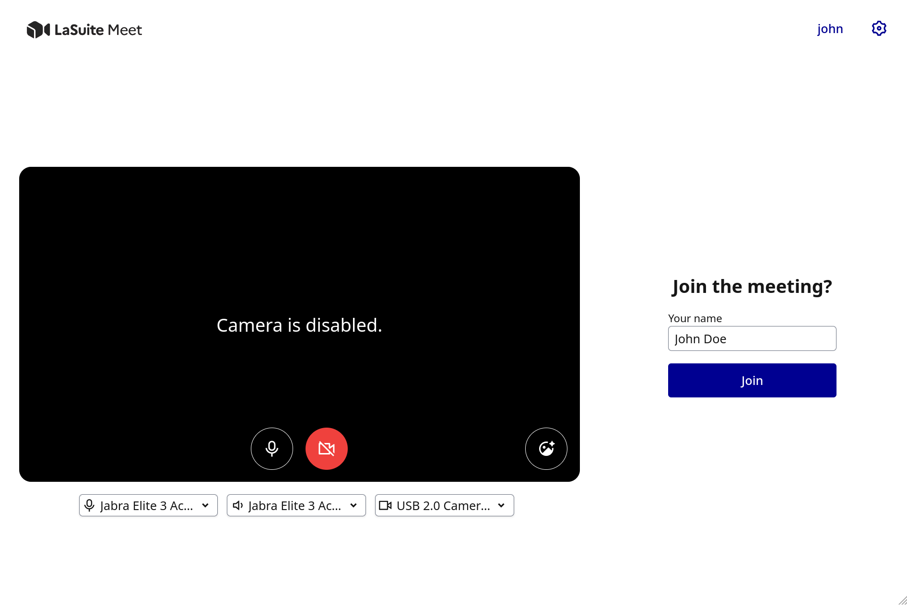
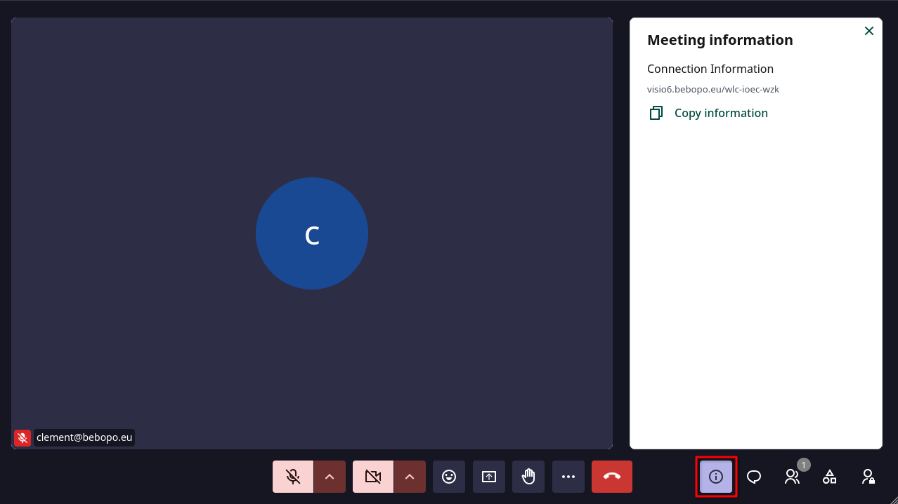
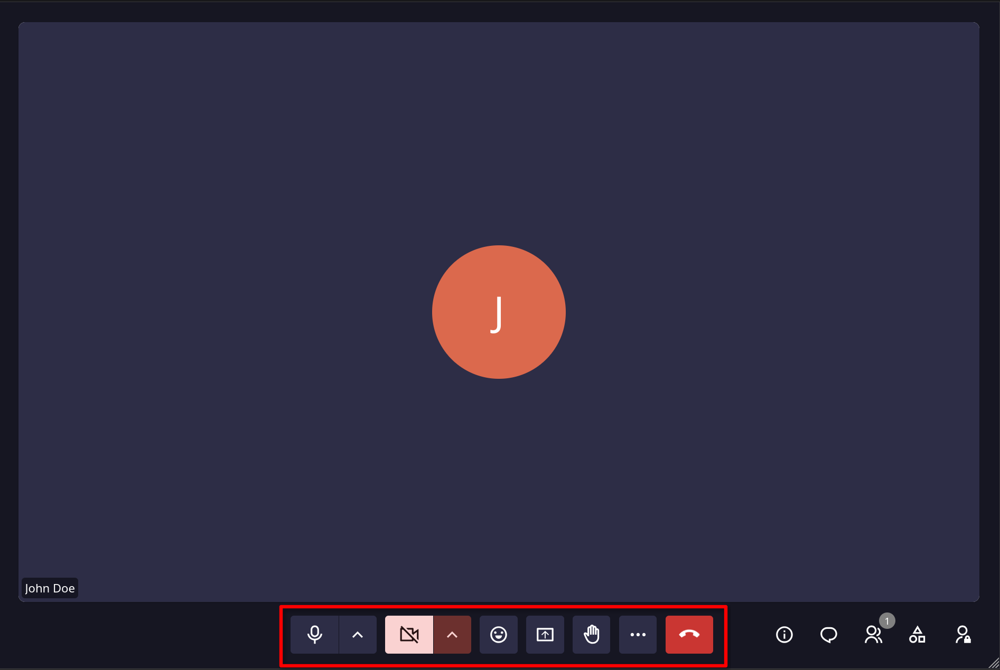

# Getting Started

**What we'll do:** Create a room, invite a participant, try the controls, and end the session. By the end, you'll know your way around Meet and feel confident hosting a real meeting.

**What you'll need:**

- Access to a Meet instance (provided by your organization, or a self-hosted instance)
- A modern browser: Chrome, Firefox, Safari, or Edge (latest version)
- A microphone (a webcam is optional but recommended)

This tutorial takes about 10 minutes.

!!! info "Optional"

    To experience Meet from both sides at once (host and participant), have a second browser tab 
    or device ready. Steps 4 and 5 include instructions for this, but you can follow the rest of the guide solo.

## Step 1: Log in and create a room

Open Meet in your browser. If your instance requires login, you'll be redirected to a login page; enter your credentials and return.

On the home page, you'll see two options:

- **Create a meeting for later** - schedules a room you can share in advance
- **Start an instant meeting** - creates a room immediately

Click **Start an instant meeting**.

Meet creates a room with a unique URL, something like `https://meet.yourdomain.com/abc-defg-hij`. You'll use this link to invite participants in a moment.

!!! info

    The room is now open and waiting. It will stay open as long as at least one participant 
    is connected, and close automatically when everyone leaves.

## Step 2: Configure your setup on the pre-join screen

{ width="700" }

Before entering the room, you land on the **pre-join screen**. This is where you configure your audio and video before others can see you.

1. Enter your name in the **Your name** field (this is what participants will see)
2. Check your camera preview; you should see yourself in the frame
3. Toggle your microphone on or off using the microphone button
4. Click **Backgrounds and effects** to configure a virtual background (optional)
5. When you're ready, click **Join**

You're now inside the meeting room.

!!! info

    If your browser hasn't yet been granted camera or microphone access, it will prompt you 
    to authorize it now. You can join with audio only if you prefer.

## Step 3: Share the meeting link

Look at the right side of the meeting room for a small info button (ⓘ). Click it to open the room information panel.

You'll see the meeting link. Click the **copy** button to copy it to your clipboard, then share it by email, chat, or any other way you prefer.

## Step 4: Join as a participant

### From a link

Click the meeting link, allow camera and microphone access when prompted, enter your name on the pre-join screen, and click **Join**.

### By meeting code

If you received a meeting code instead of a full link:

1. Go to the home page
2. Paste the meeting code into the input field
3. Click **Join meeting**

A meeting code follows the format: `abc-defg-hij`

### Restricted access (waiting room)

If the room is set to **Restricted** access, you'll see a waiting screen after clicking Join. The host is notified by a pop-up and can admit you from there or from the **Lobby** section in the Participants panel.

!!! info "Optional - try the participant side"

    Open the meeting link in a second browser tab (or on another device) and join as "Participant". 
    Switch back to your first tab to see the admit prompt appear.

## Step 5: Try the microphone and camera

The control bar at the bottom of the screen is your main interface during a meeting.

**Toggle your microphone:** Click the microphone button, or press `Ctrl+D`. The icon changes to show it's muted. Press again to unmute.

**Toggle your camera:** Click the camera button, or press `Ctrl+E`. Your video feed appears and disappears.

**Push-to-talk:** Hold `V` to temporarily unmute while the key is held.

## Step 6: Send a chat message

Click the **Chat** icon in the control bar, or press `Ctrl+Shift+M`. A chat panel opens on the right side. Type a message and press **Enter**.

!!! warning

    Chat messages are **not saved** - when the last participant leaves, the chat history is cleared. This is by design for privacy.

## Step 7: Raise your hand

Click the **Raise hand** button (✋) in the control bar to signal you want to speak without interrupting. Other participants see a raised hand indicator on your tile and a notification in the Participants panel. Click again to lower your hand.

## Step 8: Share your screen

Click the **Screen share** button in the control bar. Your browser opens a dialog asking what to share:

- **Entire screen** - shares your full desktop
- **Window** - shares a single application window
- **Browser tab** - shares a specific tab (this also offers to share the tab's audio)

Select an option and click **Share**. To stop sharing, click the **Stop sharing** button in your browser's notification bar, or click **Screen share** again.

## Step 9: Leave the meeting

Click the red **Leave** button in the control bar. You'll leave the meeting, but the room stays open for other participants. The room closes automatically when the last person leaves.

---

## What you've learned

- Created a meeting room and got the share link
- Configured audio and video on the pre-join screen
- Joined a meeting from a link and by meeting code
- Used the core controls: microphone, camera, chat, hand raise, and screen share
- Saw how the lobby (waiting room) works for Restricted-access rooms

---

## What's next?

- [Features & Controls](features-controls.md) - complete reference for every control, permission, and role
- [Recording](recording.md) - how to record a meeting and download the video
- [Settings](settings.md) - configure audio devices, noise reduction, and notifications
- [Keyboard Shortcuts](keyboard-shortcuts.md) - speed up your workflow

Common shortcuts:

| Shortcut | Action |
|---|---|
| `Ctrl+D` | Toggle microphone |
| `Ctrl+E` | Toggle camera |
| `Hold V` | Push-to-talk (hold to unmute) |
| `Ctrl+Shift+/` | Open shortcuts help |
