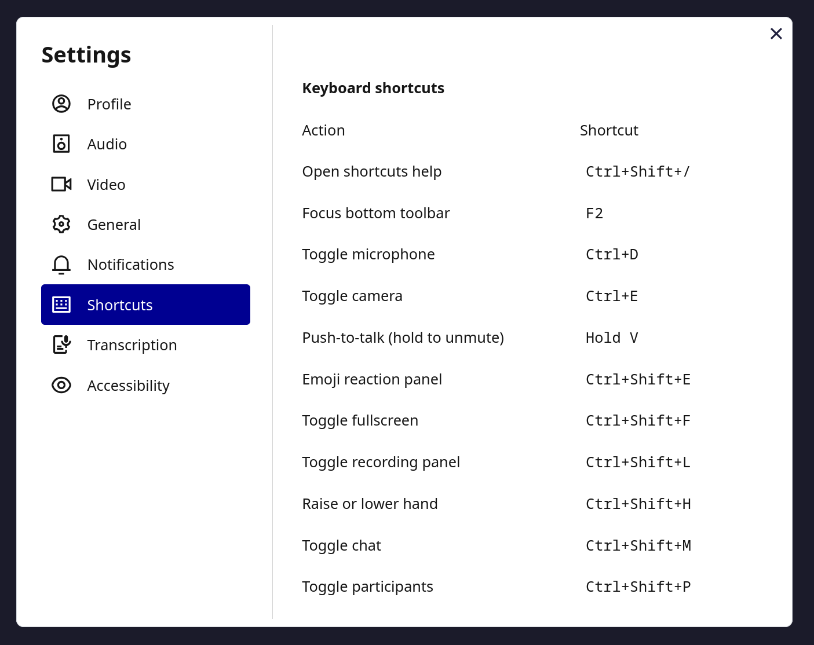

# Keyboard Shortcuts

Press `Ctrl+Shift+/` at any time to open the in-app shortcuts panel.

| Action | Shortcut |
|---|---|
| Open shortcuts help | `Ctrl+Shift+/` |
| Focus bottom toolbar | `F2` |
| Toggle microphone | `Ctrl+D` |
| Toggle camera | `Ctrl+E` |
| Push-to-talk (hold to unmute) | Hold `V` |
| Emoji reaction panel | `Ctrl+Shift+E` |
| Toggle fullscreen | `Ctrl+Shift+F` |
| Toggle recording panel | `Ctrl+Shift+L` |
| Raise or lower hand | `Ctrl+Shift+H` |
| Toggle chat | `Ctrl+Shift+M` |
| Toggle participants panel | `Ctrl+Shift+P` |
