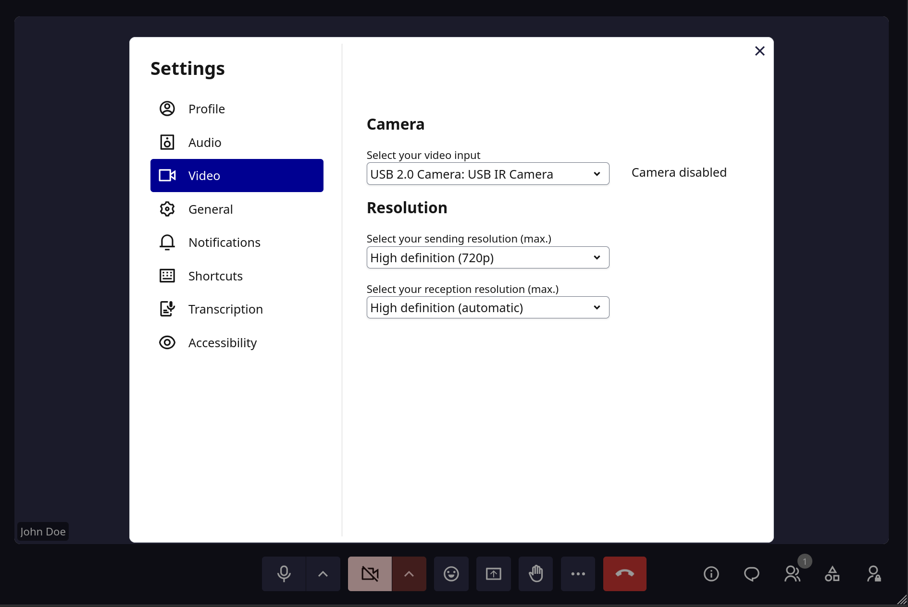

# Settings

Configure your devices, preferences, and notifications via the settings page at `/settings`. These settings are stored in your browser's local storage and persist across sessions.

## Account

Displays your current login status and username. You can update your display name here.

- **Your name**: Set your display name shown in meetings. Cannot be empty.

## Preferences

- **Auto-leave when alone**: Automatically leave a call after a few minutes if no other participant is present.

## Audio

### Microphone

Select your audio input device from the dropdown. Choose **None** to disable audio input entirely.

### Noise reduction

Toggle **Noise reduction** to enable or disable noise suppression for your microphone.

### Speakers

Select your audio output device from the dropdown.

> Speaker selection is not available in Safari.

## Video

### Camera

Select your video input device from the dropdown. Choose **None** to disable video.

### Resolution

Configure video quality for sending and receiving:

**Publishing (sending):**
- High definition
- Standard definition
- Low definition

**Subscribing (receiving):**
- High definition (auto)
- Standard definition
- Low definition

## Transcription

- **Meeting language**: Set the default language for AI transcription: French, English, Dutch, German, or Auto.

## Sound notifications

Toggle sound notifications on or off for each event:

- **Participant joined**: Sound when a new participant joins
- **Hand raised**: Sound when someone raises their hand
- **Message received**: Sound when a chat message is received

## Keyboard shortcuts

Press `Ctrl+Shift+/` to open the shortcuts panel and view all available keyboard shortcuts.

## Language

Set the interface language. Supported languages: French, English, Dutch, and German. The default depends on your instance's `LANGUAGE_CODE` setting (typically English for self-hosted deployments).
