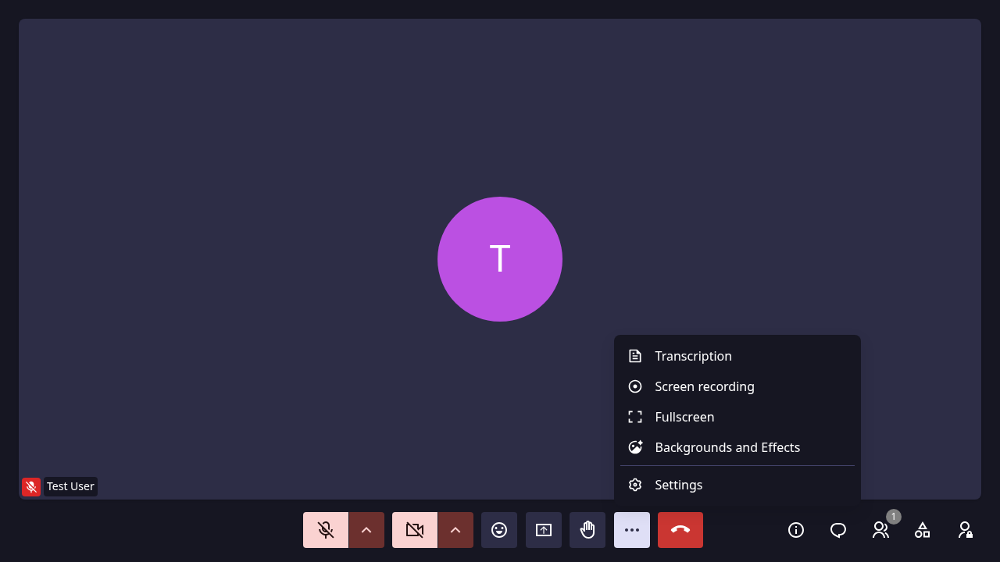

# AI Transcription

!!! warning "Work in progress"
    This article is a work in progress. AI transcription is a beta feature and has not yet been fully validated. Information may be incomplete or subject to change.

AI transcription converts meeting audio to text in real time. This feature is in beta.

## Requirements

- Transcription must be enabled on your instance
- Only room owners and administrators can start transcription
- The Summary service must be deployed (see [AI Transcription](../self-hosting/configuration/transcription.md))

## Starting transcription

1. Click **...** (More options) → **Transcription**
2. Choose the meeting language (French, English, Dutch, German, or Auto)
3. Optionally check **Also start a recording**
4. Click **Start**

## Language selection

Choosing the correct language improves transcription accuracy. Select **Automatic** for the system to detect language automatically.

## Live captions

When transcription is active, live captions appear in the meeting room.

## Stopping transcription

Click **...** → **Transcription** again to stop.

## Supported languages

- French
- English
- Dutch
- German
- Automatic
