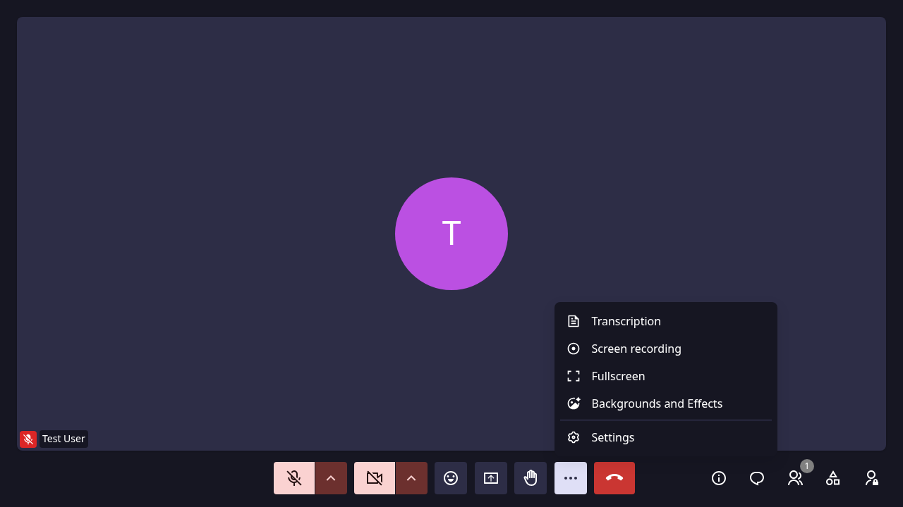

# AI Transcription

!!! warning "Beta feature"
    AI transcription is a beta feature and is still being refined.

AI transcription converts recorded meeting audio to text. The meeting is recorded, then processed asynchronously, and you receive a notification when the transcript is ready.

## Requirements

- Transcription must be enabled on your instance
- Only room owners and administrators can start transcription
- The Summary service and WhisperX API must be deployed (see [AI Transcription setup](../self-hosting/configuration/transcription.md))

## Starting transcription

1. Click **...** (More options) → **Transcription**
2. Choose the meeting language (French, English, Dutch, German, or Auto)
3. Optionally check **Also start a recording** to generate both a video file and transcript
4. Click **Start**

A recording session starts. The meeting audio is captured and will be transcribed after the session ends.

## Language selection

Choosing the correct language improves transcription accuracy. Select **Automatic** for the system to detect the language automatically.

## Getting your transcript

After the meeting ends and the recording is uploaded:

1. The Summary service downloads the audio file from storage
2. WhisperX processes the audio to generate a text transcript
3. The transcript is formatted and delivered to your LaSuite Docs instance
4. You receive a notification when the transcript is ready

The transcript is editable in LaSuite Docs.

## Stopping transcription

Click **...** → **Transcription** again to stop the recording.

## Related feature: Real-time subtitles

Meet also offers **[real-time subtitles](subtitles.md)** for accessibility. This is different from transcription:

- **Transcription** (this page): Records the meeting, then generates a text document asynchronously
- **[Real-time subtitles](subtitles.md)**: Displays live captions during the meeting for accessibility

## Supported languages

- French
- English
- Dutch
- German
- Automatic (language detection)
